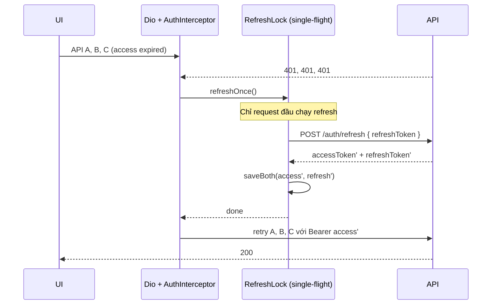
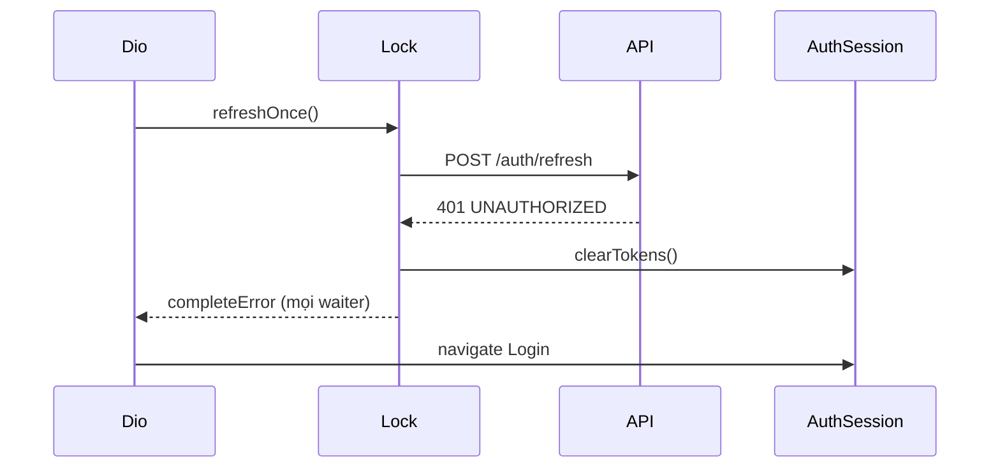

# Auth Token Refresh — Client Fix Guide

Tài liệu bắt buộc cho Flutter (hoặc mọi HTTP client) khi sửa lỗi **app treo loading sau khi access token hết hạn** (kể cả sau login Google và mọi màn gọi API).

**Root cause không nằm ở backend hang.** Backend trả `401` ngay khi access hết hạn. Hang xảy ra khi client gọi refresh sai (đặc biệt khi nhiều request song song).

---

## 1. Triệu chứng

| Hiện tượng | Nguyên nhân client thường gặp |
|------------|-------------------------------|
| Sau login Google, ngồi lâu → mở app → loading mãi | Access ~15m hết hạn; interceptor refresh race / queue không resolve |
| Mọi màn API đều treo loading khi hết token | N request 401 → N lần `POST /auth/refresh` song song |
| Log thấy 1 refresh OK rồi các refresh sau 401 | Refresh **rotate**: token cũ bị revoke ngay |

---

## 2. Contract backend (đọc trước khi code)

Base path: `/api/v1`

| Endpoint | Auth header | Body | Response `data` |
|----------|-------------|------|-----------------|
| `POST /auth/login` | Không | email/phone + password | `user`, `tenants`, **`accessToken`**, **`refreshToken`** |
| `POST /auth/login/google` | Không | `{ "idToken": "<Google/Firebase ID token>" }` | **Giống login thường** |
| `POST /auth/refresh` | **Không** | `{ "refreshToken": "..." }` | **`accessToken` + `refreshToken` mới** |
| `POST /auth/logout` | Không | `{ "refreshToken": "...", "deviceId"? }` | revoke RT |
| Mọi API nghiệp vụ | `Authorization: Bearer <accessToken>` | — | — |

TTL mặc định:

- Access: `JWT_ACCESS_EXPIRES_IN` ≈ **15 phút**
- Refresh: ≈ **7 ngày**

### 2.1 Refresh = rotate (quan trọng)

Mỗi lần `POST /auth/refresh` thành công:

1. Refresh token cũ bị **revoke ngay** trong DB.
2. Client nhận **cặp token mới** — phải lưu **cả hai**.
3. Gửi lại refresh token cũ → `401` `UNAUTHORIZED` — `"Refresh token revoked or expired"`.

→ **Cấm** gọi nhiều `/auth/refresh` song song với cùng một refresh token.

### 2.2 Access hết hạn — backend làm gì?

`Authorization: Bearer <expired>` → **HTTP 401 ngay**, body dạng:

```json
{
  "success": false,
  "error": {
    "code": "UNAUTHORIZED",
    "message": "Invalid access token"
  }
}
```

Có thể gặp thêm:

| `error.code` | Ý nghĩa | Client phải làm |
|--------------|---------|-----------------|
| `UNAUTHORIZED` | Access invalid/expired, hoặc refresh fail | Thử refresh (nếu chưa); fail → logout |
| `TOKEN_REVOKED` | `tokenVersion` đổi (force logout server) | Clear session → login lại (đừng refresh) |

Backend **không** auto-refresh. Client phải tự refresh rồi retry.

### 2.3 Google login không đặc biệt

`POST /auth/login/google` trả cùng shape token với `POST /auth/login`. Không có session riêng. Bug “sau Google” = user hay idle > 15 phút / cold start với access đã hết hạn.

---

## 3. Bug pattern cần sửa

```text
Access hết hạn
  → N API song song → N × 401
  → Interceptor mỗi request tự POST /auth/refresh (cùng RT)
  → #1: revoke RT₁, cấp RT₂ → OK
  → #2…N: RT₁ đã revoke → 401
  → Completer/queue không completeError / retry vô hạn / không navigate login
  → UI loading forever trên mọi màn
```

Các lỗi hay gặp kèm theo:

1. Chỉ lưu `accessToken`, quên `refreshToken` sau login/Google/refresh.
2. Refresh fail nhưng không `completeError` → Future treo.
3. Retry vô hạn khi refresh 401.
4. Dùng cùng Dio instance để refresh → interceptor đệ quy / deadlock.
5. Coi mọi `401` (kể cả `INVALID_CREDENTIALS` lúc login) như “cần refresh”.

---

## 4. Hướng xử lý bắt buộc: single-flight refresh

### 4.1 Quy tắc

1. Chỉ **một** `POST /auth/refresh` tại một thời điểm toàn app.
2. Các request 401 khác **chờ** refresh đó xong rồi retry với access mới.
3. Refresh success → persist **cả** `accessToken` + `refreshToken` → retry queue.
4. Refresh fail → clear tokens → reject **toàn bộ** queue → điều hướng login.
5. Timeout refresh cứng (khuyến nghị **10–15s**).
6. Không gọi refresh cho chính `/auth/refresh`, `/auth/login`, `/auth/login/google`, `/auth/logout`.
7. Dùng **Dio “bare”** (không gắn AuthInterceptor) cho `/auth/refresh`.

### 4.2 Flow



Khi refresh fail:



### 4.3 Pseudo-code (Dio / Flutter)

```dart
/// Attach to the main Dio used for business APIs.
/// Use a SEPARATE Dio (no this interceptor) for POST /auth/refresh.
class AuthInterceptor extends QueuedInterceptor {
  AuthInterceptor({
    required this.tokenStore,
    required this.refreshDio, // bare Dio, same baseUrl, no AuthInterceptor
    required this.onSessionExpired,
  });

  final TokenStore tokenStore;
  final Dio refreshDio;
  final Future<void> Function() onSessionExpired;

  Completer<void>? _refreshLock;

  static const _skipRefreshPaths = {
    '/auth/login',
    '/auth/login/google',
    '/auth/refresh',
    '/auth/logout',
    '/auth/register',
    '/auth/verify-otp',
    '/auth/forgot-password',
    '/auth/reset-password',
  };

  bool _shouldSkip(RequestOptions options) {
    final path = options.path;
    return _skipRefreshPaths.any((p) => path.endsWith(p) || path.contains(p));
  }

  bool _isAuthExpired(DioException err) {
    if (err.response?.statusCode != 401) return false;
    final code = err.response?.data is Map
        ? err.response!.data['error']?['code']
        : null;
    // Force re-login; do not refresh
    if (code == 'TOKEN_REVOKED') return false;
    // Login wrong password etc. — not session refresh
    if (code == 'INVALID_CREDENTIALS') return false;
    return true;
  }

  @override
  void onError(DioException err, ErrorInterceptorHandler handler) async {
    if (!_isAuthExpired(err) || _shouldSkip(err.requestOptions)) {
      return handler.next(err);
    }

    try {
      await _refreshOnce().timeout(const Duration(seconds: 15));
      final access = await tokenStore.readAccessToken();
      final req = err.requestOptions;
      req.headers['Authorization'] = 'Bearer $access';
      final response = await refreshDio.fetch(req); // or main dio.fetch if safe
      return handler.resolve(response);
    } catch (_) {
      await tokenStore.clear();
      await onSessionExpired(); // navigate login; MUST NOT hang
      return handler.next(err); // reject original; do not leave Future pending
    }
  }

  Future<void> _refreshOnce() {
    final existing = _refreshLock;
    if (existing != null) return existing.future;

    final lock = Completer<void>();
    _refreshLock = lock;

    Future<void>(() async {
      try {
        final refreshToken = await tokenStore.readRefreshToken();
        if (refreshToken == null || refreshToken.isEmpty) {
          throw StateError('Missing refresh token');
        }

        final res = await refreshDio.post(
          '/auth/refresh',
          data: {'refreshToken': refreshToken},
          options: Options(
            receiveTimeout: const Duration(seconds: 15),
            sendTimeout: const Duration(seconds: 15),
          ),
        );

        final data = res.data['data'] as Map<String, dynamic>;
        final newAccess = data['accessToken'] as String;
        final newRefresh = data['refreshToken'] as String;
        await tokenStore.saveTokens(
          accessToken: newAccess,
          refreshToken: newRefresh,
        );
        lock.complete();
      } catch (e, st) {
        // CRITICAL: always completeError so waiters do not hang forever
        if (!lock.isCompleted) lock.completeError(e, st);
      } finally {
        if (identical(_refreshLock, lock)) _refreshLock = null;
      }
    });

    return lock.future;
  }
}
```

> `QueuedInterceptor` giúp tuần tự hóa `onError` trong Dio; **vẫn cần** `_refreshLock` vì nhiều isolate/client hoặc gọi API ngoài Dio vẫn có thể race. Single-flight lock là nguồn sự thật.

### 4.4 Persist sau mọi login (kể cả Google)

Sau `POST /auth/login` hoặc `POST /auth/login/google`:

```dart
await tokenStore.saveTokens(
  accessToken: data['accessToken'],
  refreshToken: data['refreshToken'], // BẮT BUỘC
);
```

Checklist storage:

- [ ] Secure Storage / Keychain có **cả hai** token sau Google login
- [ ] Sau refresh thành công ghi đè **cả hai**
- [ ] Logout / session expired xóa **cả hai**

---

## 5. WebSocket / push (nếu dùng)

Khi WS hoặc `register-device` nhận 401 / unauthorized:

1. Chạy cùng `refreshOnce()` (reuse lock với HTTP).
2. Success → reconnect WS / retry register với access mới.
3. Fail → disconnect + login.

Không mở N reconnect song song mỗi cái tự refresh.

Tham chiếu: `docs/NOTIFICATION_FRONTEND_GUIDE.md`, `docs/PUSH_NOTIFICATION_FLUTTER.md`.

---

## 6. Checklist QA (client phải pass)

1. Login email → đợi access hết hạn (hoặc BE set `JWT_ACCESS_EXPIRES_IN=30s`) → mở màn gọi **≥3 API song song** → chỉ thấy **1** `POST /auth/refresh` trên network log → các API retry 200.
2. Login Google → cùng test như trên.
3. Xóa / revoke refresh (hoặc logout trên thiết bị khác nếu có) → refresh fail → app **vào login**, không loading vô hạn.
4. Sai mật khẩu login → `INVALID_CREDENTIALS` → **không** gọi `/auth/refresh`.
5. Kill app giữa chừng sau Google login → cold start → vẫn còn refresh token → API hoạt động hoặc refresh 1 lần rồi OK.
6. Refresh đang chạy + thêm 5 API → tất cả chờ cùng lock, không spawn thêm refresh.

---

## 7. Việc backend sẽ / không làm

| | |
|--|--|
| Backend trả 401 khi access hết hạn | Có — ngay |
| Backend auto-refresh giúp client | Không |
| Refresh rotate (revoke RT cũ ngay) | Có — client phải single-flight |
| Grace reuse RT vừa revoke | Có thể thêm sau; **không thay** việc client phải single-flight |

---

## 8. Liên kết

- Contract API: `docs/API.md` — `POST /auth/login`, `POST /auth/refresh`, `POST /auth/logout`
- Google: `POST /auth/login/google` body `{ idToken }` — response token giống login
- Workflow client chung: `docs/FLUTTER_WORKFLOW_GUIDE.md` §3.1 (bổ sung guide này cho auth)

---

## 9. Tóm tắt một dòng cho PR client

> Interceptor: single-flight `POST /auth/refresh`, lưu cả access+refresh, fail thì clear session + reject hết queue; không bao giờ để Completer treo và không bao giờ N refresh song song.
