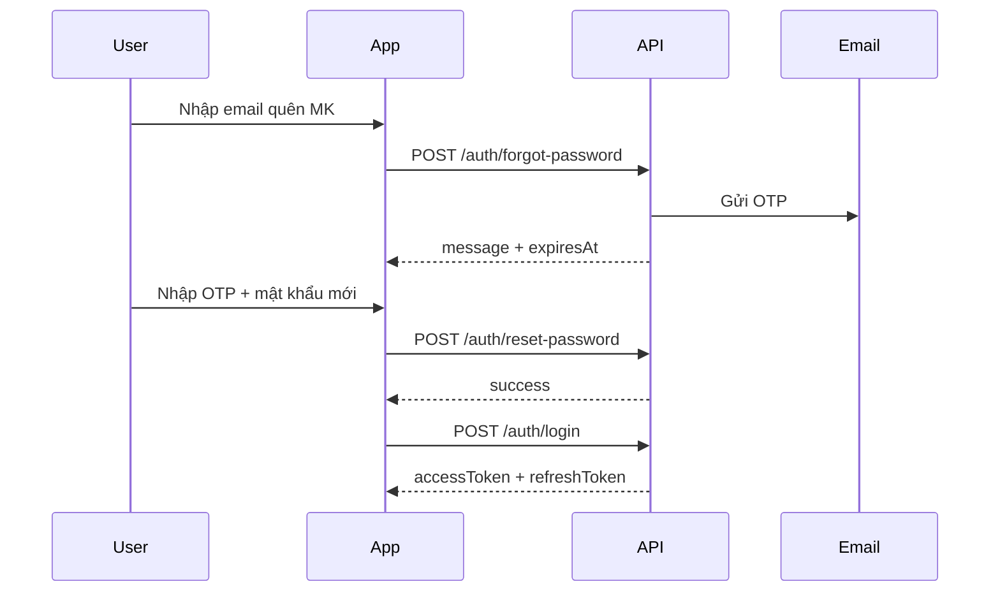

# Hướng dẫn quên mật khẩu

Tài liệu này mô tả luồng **quên mật khẩu** qua email + OTP cho API `test-y-backend`.

## Tổng quan

1. User nhập **email** → hệ thống gửi **OTP 6 số** (hết hạn sau `OTP_EXPIRES_MINUTES`, mặc định 15 phút).
2. User nhập **email + OTP + mật khẩu mới** → mật khẩu được cập nhật.
3. Mọi phiên đăng nhập cũ bị **vô hiệu** — cần đăng nhập lại.

Base URL (dev):

- Local: `http://localhost:3004/api/v1`
- Production qua Cloudflare: `https://api.kimbap.io.vn/api/v1`

## Bước 1 — Yêu cầu OTP

**Endpoint:** `POST /auth/forgot-password`

**Body:**

```json
{
  "email": "user@example.com"
}
```

**Response mẫu:**

```json
{
  "success": true,
  "data": {
    "message": "Nếu email tồn tại trong hệ thống, mã OTP đã được gửi đến hộp thư của bạn.",
    "expiresAt": "2026-08-17T06:40:00.000Z"
  }
}
```

**cURL:**

```bash
curl -X POST https://api.kimbap.io.vn/api/v1/auth/forgot-password \
  -H "Content-Type: application/json" \
  -d '{"email":"user@example.com"}'
```

**Lưu ý:**

- Kiểm tra cả **Hộp thư đến** và **Spam**.
- Môi trường dev: OTP cũng được in ra log server (`[OTP][password-reset] email: code`).
- Rate limit: **5 lần / 5 phút** (IP).
- Response luôn giống nhau dù email có tồn tại hay không (bảo mật).

## Bước 2 — Đặt mật khẩu mới

**Endpoint:** `POST /auth/reset-password`

**Body:**

```json
{
  "email": "user@example.com",
  "code": "123456",
  "newPassword": "matKhauMoi123"
}
```

**Response mẫu:**

```json
{
  "success": true,
  "data": {
    "success": true
  }
}
```

**cURL:**

```bash
curl -X POST https://api.kimbap.io.vn/api/v1/auth/reset-password \
  -H "Content-Type: application/json" \
  -d '{
    "email": "user@example.com",
    "code": "123456",
    "newPassword": "matKhauMoi123"
  }'
```

**Lỗi thường gặp:**

| Mã | HTTP | Nguyên nhân |
|----|------|-------------|
| `INVALID_OTP` | 400 | OTP sai hoặc hết hạn |
| `USER_INACTIVE` | 403 | Tài khoản bị khóa |
| `RATE_LIMITED` | 429 | Gửi quá nhiều request |

## Bước 3 — Đăng nhập lại

Sau reset, dùng mật khẩu mới:

```bash
curl -X POST https://api.kimbap.io.vn/api/v1/auth/login \
  -H "Content-Type: application/json" \
  -d '{
    "email": "user@example.com",
    "password": "matKhauMoi123"
  }'
```

## Luồng tích hợp app (mobile/web)



## Yêu cầu cấu hình server

Trong `.env`:

```env
SMTP_HOST=smtp.gmail.com
SMTP_PORT=587
SMTP_USER=your@gmail.com
SMTP_PASS=your-app-password
DEFAULT_FROM_ADDRESS=your@gmail.com
OTP_EXPIRES_MINUTES=15
```

Nếu SMTP chưa cấu hình, email **không gửi được** (dev có thể fallback Ethereal hoặc chỉ xem OTP trong log).

## Lưu ý quan trọng khi không nhận được mail

- Chỉ gửi OTP khi **email đã đăng ký** trong hệ thống. Nếu email sai, API vẫn trả 200 nhưng **không có** field `expiresAt` trong response.
- Email đã đăng ký hiện tại trong DB dev: kiểm tra bằng `POST /auth/login` hoặc hỏi admin.
- Kiểm tra **Spam / Quảng cáo**.
- Dev: OTP luôn in ra log server: `[OTP][password-reset] email: code`.
- Rate limit: **5 lần / 5 phút** — nếu bị chặn, đợi 5 phút rồi thử lại.
- Khởi động server phải thấy log `[SMTP] Connected smtp.gmail.com as ...` — nếu không, kiểm tra `SMTP_USER` / `SMTP_PASS` (App Password Gmail, bỏ dấu cách).


| Mục đích | Endpoint gửi OTP | Purpose trong DB |
|----------|------------------|----------------|
| Xác minh email lúc đăng ký | `POST /auth/register` (tự động) / `POST /auth/resend-otp` | `verify_email` |
| Quên mật khẩu | `POST /auth/forgot-password` | `reset_password` |

OTP đăng ký **không** dùng được cho reset password và ngược lại.
