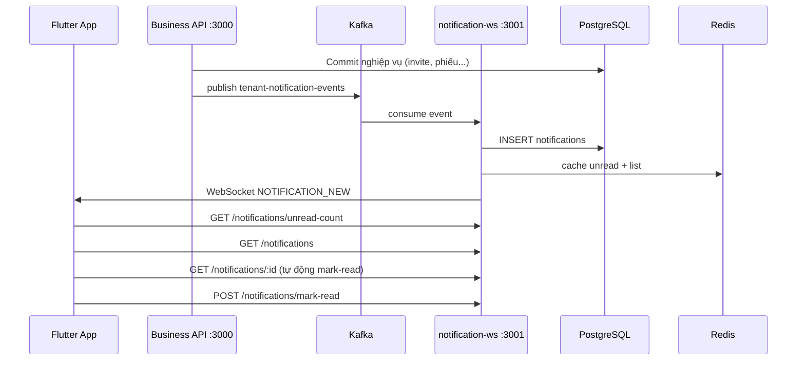

# Notification WebSocket + Inbox API

Phase 1: realtime notification qua WebSocket + inbox REST API. **Không dùng FCM** trong phase này.

## Kiến trúc



## Chạy local

```bash
# Infra
docker compose up -d
docker compose -f docker-compose.kafka.yml up -d

# Business API + notification-ws
npm run dev:all
```

Env (`.env`):

```env
KAFKA_BROKERS=localhost:9094
KAFKA_ENABLED=true
NOTIFICATION_WS_PORT=3001
```

Nếu chưa có Kafka, đặt `KAFKA_ENABLED=false` — API vẫn chạy bình thường, chỉ không gửi notification.

## REST API (port 3001)

Base URL: `http://localhost:3001/api/v1`

Auth: `Authorization: Bearer <accessToken>` (cùng JWT với Business API)

### `GET /notifications/unread-count`

```json
{ "success": true, "data": { "count": 3 } }
```

### `GET /notifications`

Query:

| Param | Mặc định | Mô tả |
|-------|----------|-------|
| `limit` | 20 | 1–50 |
| `cursor` | — | Pagination cursor |
| `onlyUnread` | false | Chỉ thông báo chưa đọc |
| `tenantId` | — | Lọc theo tenant |

Response:

```json
{
  "success": true,
  "data": {
    "items": [
      {
        "id": "clx...",
        "type": "receipt_submitted",
        "title": "Phiếu nhập chờ duyệt",
        "body": "Admin đã gửi phiếu nhập PN-001",
        "tenantId": "tenant-id",
        "readAt": null,
        "createdAt": "2026-08-18T02:00:00.000Z",
        "actorName": "Admin",
        "routeName": "stock_receipt_detail",
        "routeParams": { "receiptId": "...", "tenantId": "..." },
        "deeplink": "myapp://stock-receipts/..."
      }
    ],
    "nextCursor": "..."
  }
}
```

### `GET /notifications/:id`

Xem chi tiết **1** notification. Nếu notification đang **chưa đọc**, server **tự động đánh dấu đã đọc** (`readAt = now`) trước khi trả về.

Không tìm thấy hoặc không thuộc user → `404 NOT_FOUND`:

```json
{
  "success": false,
  "error": { "code": "NOT_FOUND", "message": "Notification not found" }
}
```

Response:

```json
{
  "success": true,
  "data": {
    "item": {
      "id": "clx...",
      "type": "receipt_submitted",
      "title": "Phiếu nhập chờ duyệt",
      "body": "Admin đã gửi phiếu nhập PN-001",
      "readAt": "2026-08-19T02:00:00.000Z",
      "createdAt": "2026-08-18T02:00:00.000Z",
      "actorName": "Admin",
      "routeName": "stock_receipt_detail",
      "routeParams": { "receiptId": "...", "tenantId": "..." },
      "deeplink": "myapp://stock-receipts/..."
    },
    "unreadCount": 3
  }
}
```

- `item.readAt` đã được set nếu trước đó là unread
- `unreadCount` = số chưa đọc **sau khi** đã đánh dấu (cập nhật badge ngay)

### `POST /notifications/mark-read`

Body:

```json
{ "notificationIds": ["id1", "id2"] }
```

Hoặc mark all:

```json
{ "markAll": true, "tenantId": "optional-tenant-filter" }
```

## WebSocket

URL: `ws://localhost:3001/notifications?token=<accessToken>`

### Client → Server

```json
{ "type": "PING" }
```

### Server → Client

Pong:

```json
{ "type": "PONG" }
```

Notification mới:

```json
{
  "type": "NOTIFICATION_NEW",
  "unreadCount": 4,
  "data": { /* NotificationItem */ }
}
```

## Flutter flow

| Thời điểm | Action |
|-----------|--------|
| Sau login | `GET /notifications/unread-count` |
| Sau login | Connect WebSocket |
| Nhận WS | Cập nhật badge |
| Mở inbox | `GET /notifications?limit=20` |
| Tap vào thông báo | `GET /notifications/:id` (tự động mark-read) |
| Mark read hàng loạt | `POST /notifications/mark-read` |
| App resume | Reconnect WS + sync unread-count |

```dart
const notifApiBase = 'http://localhost:3001/api/v1';
const wsUrl = 'ws://localhost:3001/notifications';
```

## Event types (phase 1)

| Event | Trigger |
|-------|---------|
| `invitation_created` | Admin invite user đã có tài khoản |
| `invitation_accepted` | User accept invite → notify admin |
| `user_created` | Admin tạo user nội bộ (`POST /tenants/current/users`) → notify admin |
| `user_login` | User đăng nhập (email/password hoặc Google) → notify admin các tenant của user |
| `receipt_submitted/approved/rejected/completed/cancelled` | Lifecycle phiếu nhập |
| `issue_submitted/approved/rejected/completed/cancelled` | Lifecycle phiếu xuất |

## Cache

- `notif:unread:{userId}` — badge count
- `notif:list:{userId}:latest:20` — trang đầu inbox, TTL 60s

Invalidate khi có notification mới, xem chi tiết (`GET /:id` mark-read) hoặc mark-read.
