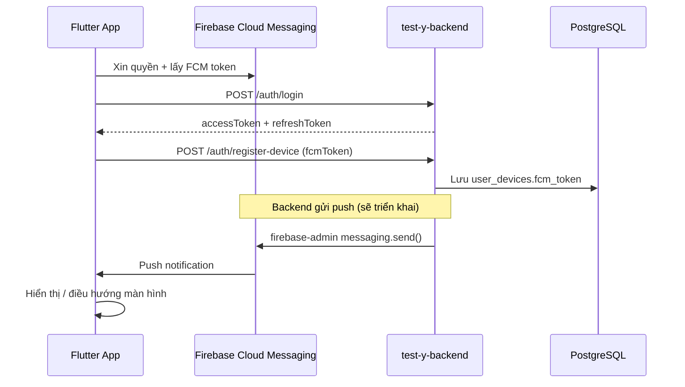

# Hướng dẫn tích hợp Push Notification — Backend ↔ Flutter

Tài liệu mô tả cách tích hợp **Firebase Cloud Messaging (FCM)** giữa app Flutter và backend `test-y-backend`.

## Tổng quan kiến trúc



**Luồng cơ bản:**

1. App Flutter cấu hình Firebase, xin quyền thông báo, lấy **FCM token**.
2. User đăng nhập backend → nhận JWT.
3. App gọi **`POST /auth/register-device`** để gửi `fcmToken` lên server.
4. Backend lưu token vào bảng `user_devices`.
5. Khi có sự kiện nghiệp vụ, backend gửi push qua FCM tới các thiết bị `active` của user.

Base URL:

- Local: `http://localhost:3004/api/v1`
- Production: `https://api.kimbap.io.vn/api/v1`

---

## Trạng thái triển khai hiện tại

| Thành phần | Trạng thái | Ghi chú |
|------------|------------|---------|
| `POST /auth/register-device` | ✅ Có | Lưu / cập nhật FCM token |
| `POST /auth/logout` + `deviceId` | ✅ Có | Đặt thiết bị `inactive` |
| Bảng `user_devices` | ✅ Có | Lưu `fcm_token`, `device_type`, `status` |
| Firebase Admin (Google Sign-In) | ✅ Có | Verify Google ID token |
| **Gửi push từ backend** | ⏳ Chưa | Chưa có service `firebase-admin/messaging` |
| **Notification realtime (WS + inbox)** | ✅ Có | Xem [NOTIFICATION_WS.md](./NOTIFICATION_WS.md) — phase 1 không dùng FCM |
| API inbox / đánh dấu đã đọc | ✅ Có | Service `notification-ws` port 3001 |

> **Flutter vẫn nên tích hợp ngay** phần đăng ký FCM token. Khi backend bật gửi push, app không cần đổi luồng đăng ký thiết bị.

---

## API Backend (phía Flutter cần gọi)

### 1. Đăng nhập

**Endpoint:** `POST /auth/login`

```json
{
  "email": "user@example.com",
  "password": "matKhau123"
}
```

Lưu `accessToken`, `refreshToken` (Secure Storage / flutter_secure_storage).

---

### 2. Đăng ký thiết bị + FCM token

**Endpoint:** `POST /auth/register-device`

**Auth:** `Authorization: Bearer <accessToken>`

**Body:**

| Field | Type | Bắt buộc | Ghi chú |
|-------|------|----------|---------|
| `deviceId` | string | ✅ | UUID cố định do app sinh, lưu local |
| `deviceType` | string | ✅ | `android` hoặc `ios` |
| `fcmToken` | string | Khuyến nghị | Token từ Firebase Messaging |
| `deviceModel` | string | ❌ | VD: `Pixel 8`, `iPhone 15` |
| `osVersion` | string | ❌ | VD: `Android 14`, `iOS 17.0` |
| `appVersion` | string | ❌ | VD: `1.0.0` |
| `deviceInfo` | object | ❌ | Metadata bổ sung |

**Request mẫu:**

```json
{
  "deviceId": "a1b2c3d4-e5f6-7890-abcd-ef1234567890",
  "deviceType": "android",
  "fcmToken": "fcm-token-from-firebase",
  "deviceModel": "Pixel 8",
  "osVersion": "Android 14",
  "appVersion": "1.0.0"
}
```

**Response 200:**

```json
{
  "success": true,
  "data": {
    "id": "cuid",
    "deviceId": "a1b2c3d4-e5f6-7890-abcd-ef1234567890",
    "deviceType": "android",
    "deviceModel": "Pixel 8",
    "osVersion": "Android 14",
    "appVersion": "1.0.0",
    "status": "active",
    "lastLoginAt": "2026-08-17T09:00:00.000Z",
    "createdAt": "2026-08-17T09:00:00.000Z",
    "updatedAt": "2026-08-17T09:00:00.000Z"
  },
  "message": "Device registered"
}
```

**Quy tắc:**

- Gọi **sau mỗi lần login** thành công.
- Gọi lại khi FCM token **refresh** (`onTokenRefresh`).
- Gọi lại cùng `deviceId` → backend **update** (message: `"Device updated"`).
- `deviceId` là khóa duy nhất toàn hệ thống — một thiết bị chỉ gắn với user cuối cùng đăng ký.

**cURL:**

```bash
curl -X POST https://api.kimbap.io.vn/api/v1/auth/register-device \
  -H "Authorization: Bearer eyJ..." \
  -H "Content-Type: application/json" \
  -d '{
    "deviceId": "a1b2c3d4-e5f6-7890-abcd-ef1234567890",
    "deviceType": "android",
    "fcmToken": "fcm-token-from-firebase",
    "deviceModel": "Pixel 8",
    "osVersion": "Android 14",
    "appVersion": "1.0.0"
  }'
```

---

### 3. Đăng xuất — hủy nhận push trên thiết bị

**Endpoint:** `POST /auth/logout`

**Body:**

```json
{
  "refreshToken": "eyJ...",
  "deviceId": "a1b2c3d4-e5f6-7890-abcd-ef1234567890"
}
```

- `deviceId` tùy chọn nhưng **nên gửi** — backend đặt thiết bị thành `inactive`, không gửi push tới token đó nữa.
- Revoke refresh token → cần login lại.

---

## Cấu hình Firebase cho Flutter

### Bước 1 — Tạo project Firebase

1. Vào [Firebase Console](https://console.firebase.google.com/).
2. Tạo project (hoặc dùng project đã có).
3. Thêm app **Android** và **iOS** (bundle ID / package name khớp app Flutter).

### Bước 2 — Thêm app Flutter

Trong thư mục Flutter:

```bash
dart pub global activate flutterfire_cli
flutterfire configure
```

Lệnh này tạo `lib/firebase_options.dart` và tải `google-services.json` (Android) / `GoogleService-Info.plist` (iOS).

### Bước 3 — Dependencies

```yaml
# pubspec.yaml
dependencies:
  firebase_core: ^3.8.0
  firebase_messaging: ^15.1.0
  flutter_local_notifications: ^18.0.0
  flutter_secure_storage: ^9.2.0
  uuid: ^4.5.0
  http: ^1.2.0
  device_info_plus: ^11.0.0
  package_info_plus: ^8.0.0
```

### Bước 4 — Android

`android/app/build.gradle`:

```gradle
plugins {
    id "com.google.gms.google-services"
}
```

`android/app/src/main/AndroidManifest.xml` — thêm trong `<application>`:

```xml
<meta-data
    android:name="com.google.firebase.messaging.default_notification_channel_id"
    android:value="default" />
```

Tạo notification channel (Android 8+):

```dart
const channel = AndroidNotificationChannel(
  'default',
  'Thông báo chung',
  importance: Importance.high,
);
await flutterLocalNotificationsPlugin
    .resolvePlatformSpecificImplementation<
        AndroidFlutterLocalNotificationsPlugin>()
    ?.createNotificationChannel(channel);
```

### Bước 5 — iOS

1. Xcode → **Signing & Capabilities** → bật **Push Notifications**.
2. Bật **Background Modes** → **Remote notifications**.
3. Upload APNs key/certificate lên Firebase Console (Project Settings → Cloud Messaging).

`ios/Runner/AppDelegate.swift`:

```swift
import FirebaseCore
import FirebaseMessaging

// Trong didFinishLaunchingWithOptions:
FirebaseApp.configure()
UNUserNotificationCenter.current().delegate = self
application.registerForRemoteNotifications()
```

---

## Code Flutter mẫu

### Khởi tạo và lấy FCM token

```dart
import 'dart:io';
import 'package:firebase_core/firebase_core.dart';
import 'package:firebase_messaging/firebase_messaging.dart';
import 'package:uuid/uuid.dart';
import 'firebase_options.dart';

@pragma('vm:entry-point')
Future<void> firebaseMessagingBackgroundHandler(RemoteMessage message) async {
  await Firebase.initializeApp(options: DefaultFirebaseOptions.currentPlatform);
  // Xử lý notification khi app ở background/terminated
}

class PushNotificationService {
  PushNotificationService(this.apiClient);

  final ApiClient apiClient;
  final FirebaseMessaging _messaging = FirebaseMessaging.instance;
  static const _deviceIdKey = 'device_id';

  Future<void> init() async {
    await Firebase.initializeApp(options: DefaultFirebaseOptions.currentPlatform);
    FirebaseMessaging.onBackgroundMessage(firebaseMessagingBackgroundHandler);

    final settings = await _messaging.requestPermission(
      alert: true,
      badge: true,
      sound: true,
    );
    if (settings.authorizationStatus == AuthorizationStatus.denied) {
      return;
    }

    FirebaseMessaging.onMessage.listen(_onForegroundMessage);
    FirebaseMessaging.onMessageOpenedApp.listen(_onNotificationTap);
    _messaging.onTokenRefresh.listen((token) => _registerDevice(fcmToken: token));

    final initial = await _messaging.getInitialMessage();
    if (initial != null) _onNotificationTap(initial);

    final token = await _messaging.getToken();
    if (token != null) {
      await _registerDevice(fcmToken: token);
    }
  }

  /// Gọi sau login thành công
  Future<void> registerAfterLogin() async {
    final token = await _messaging.getToken();
    if (token != null) {
      await _registerDevice(fcmToken: token);
    }
  }

  Future<String> _getOrCreateDeviceId() async {
    final stored = await apiClient.secureStorage.read(key: _deviceIdKey);
    if (stored != null) return stored;
    final id = const Uuid().v4();
    await apiClient.secureStorage.write(key: _deviceIdKey, value: id);
    return id;
  }

  Future<void> _registerDevice({required String fcmToken}) async {
    final accessToken = await apiClient.getAccessToken();
    if (accessToken == null) return; // chưa login

    final deviceId = await _getOrCreateDeviceId();
    final deviceInfo = await _collectDeviceInfo();

    await apiClient.post(
      '/auth/register-device',
      headers: {'Authorization': 'Bearer $accessToken'},
      body: {
        'deviceId': deviceId,
        'deviceType': Platform.isIOS ? 'ios' : 'android',
        'fcmToken': fcmToken,
        ...deviceInfo,
      },
    );
  }

  void _onForegroundMessage(RemoteMessage message) {
    // Hiển thị local notification hoặc in-app banner
    final notification = message.notification;
    if (notification != null) {
      // flutter_local_notifications.show(...)
    }
  }

  void _onNotificationTap(RemoteMessage message) {
    final data = message.data;
    final type = data['type'];
    final tenantId = data['tenantId'];
    final targetId = data['targetId'];

    // Điều hướng theo type — xem mục "Quy ước payload"
    switch (type) {
      case 'stock_receipt_pending':
        // Navigator.pushNamed(context, '/stock-receipts/$targetId', ...);
        break;
      default:
        break;
    }
  }
}
```

### Luồng sau login

```dart
Future<void> login(String email, String password) async {
  final response = await apiClient.post('/auth/login', body: {
    'email': email,
    'password': password,
  });

  await apiClient.saveTokens(
    accessToken: response['accessToken'],
    refreshToken: response['refreshToken'],
  );

  // Bắt buộc: đăng ký thiết bị để nhận push
  await pushService.registerAfterLogin();

  // Chọn tenant nếu có nhiều tổ chức
  final tenants = response['tenants'] as List;
  // ...
}
```

### Luồng logout

```dart
Future<void> logout() async {
  final refreshToken = await apiClient.getRefreshToken();
  final deviceId = await pushService.getDeviceId();

  await apiClient.post('/auth/logout', body: {
    'refreshToken': refreshToken,
    'deviceId': deviceId,
  });

  await apiClient.clearTokens();
}
```

---

## Khi nào gọi `register-device`?

| Sự kiện | Hành động |
|---------|-----------|
| Login thành công | Gọi `register-device` |
| App mở lại (đã có token JWT hợp lệ) | Gọi `register-device` (cập nhật FCM token) |
| `onTokenRefresh` | Gọi `register-device` |
| User cấp quyền notification lần đầu | Gọi `register-device` |
| Logout | Gọi `logout` kèm `deviceId` |

---

## Quy ước payload push (đề xuất)

Khi backend triển khai gửi push, payload FCM nên theo format sau để Flutter xử lý thống nhất:

### Data payload (bắt buộc cho điều hướng)

```json
{
  "type": "stock_receipt_pending",
  "tenantId": "cuid-tenant",
  "targetId": "cuid-document",
  "title": "Phiếu nhập chờ duyệt",
  "body": "PN-2026-001 cần phê duyệt"
}
```

### Các `type` gợi ý

| type | Mô tả | targetId |
|------|-------|----------|
| `stock_receipt_pending` | Phiếu nhập chờ duyệt | ID phiếu nhập |
| `stock_receipt_approved` | Phiếu nhập đã duyệt | ID phiếu nhập |
| `stock_issue_pending` | Phiếu xuất chờ duyệt | ID phiếu xuất |
| `stock_issue_approved` | Phiếu xuất đã duyệt | ID phiếu xuất |
| `invite_received` | Lời mời tham gia tổ chức | invitation ID |
| `general` | Thông báo chung | null |

### Notification payload (hiển thị system tray)

```json
{
  "notification": {
    "title": "Phiếu nhập chờ duyệt",
    "body": "PN-2026-001 cần phê duyệt"
  },
  "data": {
    "type": "stock_receipt_pending",
    "tenantId": "cuid-tenant",
    "targetId": "cuid-document"
  }
}
```

**Lưu ý Flutter:**

- Khi app **foreground**: `onMessage` nhận message, cần tự hiển thị (local notification).
- Khi app **background/terminated**: system tray hiển thị từ `notification` block; tap mở app qua `onMessageOpenedApp` / `getInitialMessage`.
- Luôn đọc `data` để điều hướng — không chỉ dựa vào `notification.title/body`.
- Nếu push liên quan tenant, set `X-Tenant-Id` trước khi gọi API chi tiết.

---

## Cấu hình backend (cho team backend)

Trong `.env` (dùng chung service account Firebase):

```env
FIREBASE_PROJECT_ID=your-project-id
FIREBASE_SERVICE_ACCOUNT_PATH=./secrets/firebase-service-account.json
```

Backend hiện dùng Firebase Admin cho **Google Sign-In**. Khi triển khai gửi push, cần thêm:

```typescript
import { getMessaging } from 'firebase-admin/messaging';

// Gửi tới tất cả thiết bị active của user
await getMessaging().sendEachForMulticast({
  tokens: fcmTokens,
  notification: { title, body },
  data: { type, tenantId, targetId },
  android: { priority: 'high' },
  apns: { payload: { aps: { sound: 'default' } } },
});
```

Query thiết bị cần gửi:

```sql
SELECT fcm_token FROM user_devices
WHERE user_id = $1 AND status = 'active' AND fcm_token IS NOT NULL;
```

---

## Xử lý lỗi & edge cases

| Tình huống | Cách xử lý |
|------------|------------|
| User từ chối quyền notification | Vẫn login bình thường; gọi `register-device` không có `fcmToken` hoặc bỏ qua |
| FCM token null (simulator iOS) | Bỏ qua register; test trên thiết bị thật |
| Token JWT hết hạn khi register | Refresh token trước, rồi gọi lại `register-device` |
| User đăng nhập trên thiết bị khác | Cùng `deviceId` trên một máy; máy khác có `deviceId` riêng |
| Đăng nhập account khác trên cùng máy | `deviceId` giữ nguyên, backend re-assign thiết bị sang user mới |

---

## Checklist tích hợp Flutter

- [ ] Cấu hình Firebase (`flutterfire configure`)
- [ ] Xin quyền notification (iOS + Android 13+)
- [ ] Sinh và lưu `deviceId` cố định (Secure Storage)
- [ ] Gọi `POST /auth/register-device` sau login
- [ ] Lắng nghe `onTokenRefresh` → gọi lại register-device
- [ ] Xử lý foreground notification (local notification)
- [ ] Xử lý tap notification → điều hướng theo `data.type`
- [ ] Gọi logout kèm `deviceId`
- [ ] Test trên thiết bị thật (Android + iOS)

---

## Troubleshooting

### Không nhận được push

1. Kiểm tra `user_devices.fcm_token` trong DB có giá trị và `status = active`.
2. Kiểm tra backend đã triển khai service gửi FCM chưa (hiện **chưa**).
3. iOS: kiểm tra APNs key trên Firebase Console.
4. Android: kiểm tra `google-services.json` đúng package name.

### `register-device` trả 401

Access token hết hạn — gọi `POST /auth/refresh` rồi thử lại.

### Token refresh liên tục

Bình thường khi cài lại app hoặc xóa data. Mỗi lần refresh, gọi lại `register-device`.

---

## Tài liệu liên quan

- [API.md](./API.md) — mục `POST /auth/register-device`, `POST /auth/logout`
- [USER_TENANTS.md](./USER_TENANTS.md) — chọn tổ chức (`X-Tenant-Id`) khi mở notification có `tenantId`
- [FORGOT_PASSWORD.md](./FORGOT_PASSWORD.md) — luồng auth mẫu
