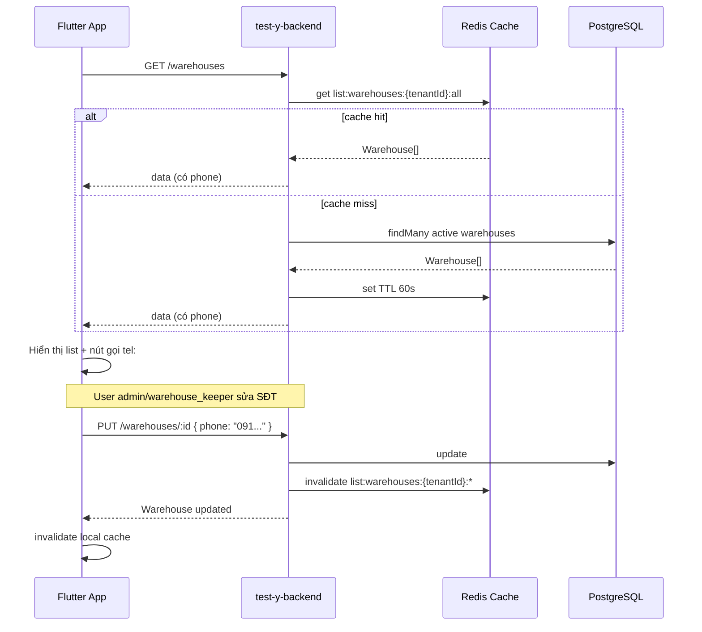

# Hướng dẫn tích hợp số điện thoại kho — Backend ↔ Flutter

Tài liệu mô tả cách app Flutter **gửi và nhận số điện thoại liên hệ kho** qua API `test-y-backend`.

## Tổng quan

| Thành phần | Trạng thái |
|------------|------------|
| Field `phone` trên model `Warehouse` | ✅ Có |
| `GET /warehouses` trả `phone` | ✅ Có |
| `GET /warehouses/:id` trả `phone` | ✅ Có |
| `POST /warehouses` nhận `phone` | ✅ Có |
| `PUT /warehouses/:id` cập nhật/xóa `phone` | ✅ Có |
| `PATCH /warehouses/:id/deactivate` ngừng hoạt động kho | ✅ Có |
| `PATCH /warehouses/:id/activate` kích hoạt lại kho | ✅ Có |
| Cache server-side (Redis) | ✅ Có — TTL 60 giây |
| Cache phía Flutter | ⚠️ Khuyến nghị — xem mục [Cache](#cache-dữ-liệu-kho) |

Base URL:

- Local: `http://localhost:3004/api/v1`
- Production: `https://api.kimbap.io.vn/api/v1`

**Auth bắt buộc cho mọi endpoint kho:**

```
Authorization: Bearer <accessToken>
X-Tenant-Id: <tenantId>
Content-Type: application/json
```

---

## Quy tắc field `phone`

| Quy tắc | Chi tiết |
|---------|----------|
| Bắt buộc | ❌ Không — có thể bỏ qua hoặc gửi `null` |
| Định dạng | Chuỗi tự do — backend **không** validate E.164, độ dài, hay regex SĐT Việt Nam |
| Trim | Backend **không** tự trim — nên trim phía Flutter trước khi gửi |
| Unique | ❌ Không — nhiều kho có thể dùng cùng SĐT |
| Tìm kiếm theo SĐT | ❌ Không — `GET /warehouses?search=` chỉ tìm theo `code` và `name` |
| Quyền ghi | `admin`, `warehouse_keeper` |
| Quyền đọc | Mọi role trong tenant |

**Hành vi theo endpoint:**

| Endpoint | Không gửi `phone` | Gửi `"0901234567"` | Gửi `null` |
|----------|-------------------|--------------------|------------|
| `POST /warehouses` | Lưu `null` | Lưu chuỗi | Lưu `null` |
| `PUT /warehouses/:id` | Giữ nguyên giá trị cũ | Cập nhật | Xóa SĐT (`NULL`) |

---

## API lấy danh sách kho (có số điện thoại)

### `GET /warehouses`

Lấy danh sách kho **đang active** (`isActive = true`), sắp xếp theo `code`.

**Query params (tùy chọn):**

| Param | Type | Ghi chú |
|-------|------|---------|
| `page` | number | Phân trang — nếu có query thì trả dạng paginated |
| `limit` | number | Mặc định theo `paginationSchema` |
| `search` | string | Tìm theo `code` hoặc `name` — **không** tìm theo `phone` |

**Không truyền query** → trả **mảng phẳng** (phù hợp dropdown chọn kho):

```json
{
  "success": true,
  "data": [
    {
      "id": "clxyz123",
      "tenantId": "tenant-abc",
      "code": "WH01",
      "name": "Kho chính",
      "address": "123 Nguyễn Huệ, Q.1",
      "phone": "0901234567",
      "isActive": true,
      "latitude": "10.8231000",
      "longitude": "106.6297000",
      "geoSource": "manual",
      "geocodeStatus": "success",
      "geocodedAt": null,
      "createdAt": "2026-08-18T06:00:00.000Z",
      "updatedAt": "2026-08-18T06:00:00.000Z"
    },
    {
      "id": "clxyz456",
      "tenantId": "tenant-abc",
      "code": "WH02",
      "name": "Kho chi nhánh",
      "address": null,
      "phone": null,
      "isActive": true,
      "latitude": null,
      "longitude": null,
      "geoSource": null,
      "geocodeStatus": "not_applicable",
      "geocodedAt": null,
      "createdAt": "2026-08-18T06:00:00.000Z",
      "updatedAt": "2026-08-18T06:00:00.000Z"
    }
  ]
}
```

**Có query phân trang** → trả dạng paginated:

```json
{
  "success": true,
  "data": {
    "items": [ /* ... Warehouse[] ... */ ],
    "page": 1,
    "limit": 20,
    "total": 5,
    "totalPages": 1
  }
}
```

**cURL:**

```bash
curl -X GET "https://api.kimbap.io.vn/api/v1/warehouses" \
  -H "Authorization: Bearer eyJ..." \
  -H "X-Tenant-Id: tenant-abc"
```

---

### `GET /warehouses/:id`

Lấy chi tiết một kho (kể cả kho inactive nếu biết `id`).

**Response 200** — object `Warehouse` (cùng schema như phần tử trong list ở trên).

**Lỗi:** `NOT_FOUND` (404)

---

## API gửi số điện thoại lên server

### `POST /warehouses` — Tạo kho mới

**Role:** `admin`, `warehouse_keeper`

**Body:**

```json
{
  "code": "WH03",
  "name": "Kho mới",
  "address": "456 Lê Lợi",
  "phone": "0909876543",
  "latitude": 10.7769,
  "longitude": 106.7009
}
```

| Field | Type | Bắt buộc |
|-------|------|----------|
| `code` | string | ✅ |
| `name` | string | ✅ |
| `address` | string | ❌ |
| `phone` | string \| null | ❌ |
| `latitude` | number | ❌ — -90 đến 90 |
| `longitude` | number | ❌ — -180 đến 180 |

**Response 201** — object `Warehouse` vừa tạo (có `phone`).

**Lỗi:** `DUPLICATE_CODE` (409), `FORBIDDEN` (403)

---

### `PUT /warehouses/:id` — Cập nhật kho

**Role:** `admin`, `warehouse_keeper`  
**Body:** Partial — chỉ gửi field cần sửa.

Cập nhật SĐT:

```json
{
  "phone": "0912345678"
}
```

Xóa SĐT:

```json
{
  "phone": null
}
```

**Response 200** — object `Warehouse` đã cập nhật.

> ⚠️ **Lưu ý quan trọng:** `PUT` **không** hỗ trợ đổi `isActive`. Nếu gửi `{ "isActive": false }` qua `PUT`, backend sẽ **bỏ qua** field này (Zod schema không chứa `isActive`). Xem mục bên dưới để đổi trạng thái hoạt động.

---

## API đổi trạng thái hoạt động kho

### `PATCH /warehouses/:id/deactivate` — Ngừng hoạt động kho

**Role:** `admin`, `warehouse_keeper`  
**Body:** Không cần gửi body.

Đặt `isActive = false`. Kho sẽ **không hiển thị** trong `GET /warehouses` nữa.

```bash
curl -X PATCH "https://api.kimbap.io.vn/api/v1/warehouses/<warehouseId>/deactivate" \
  -H "Authorization: Bearer eyJ..." \
  -H "X-Tenant-Id: tenant-abc"
```

**Response 200** — object `Warehouse` với `isActive: false`.

**Lỗi:** `NOT_FOUND` (404)

> **Lưu ý:** `DELETE /warehouses/:id` vẫn hoạt động (cùng logic soft-delete). `PATCH /deactivate` rõ ràng hơn về ngữ nghĩa.

---

### `PATCH /warehouses/:id/activate` — Kích hoạt lại kho

**Role:** `admin`, `warehouse_keeper`  
**Body:** Không cần gửi body.

Khôi phục kho đang inactive (`isActive = false`) về trạng thái active (`isActive = true`).

```bash
curl -X PATCH "https://api.kimbap.io.vn/api/v1/warehouses/<warehouseId>/activate" \
  -H "Authorization: Bearer eyJ..." \
  -H "X-Tenant-Id: tenant-abc"
```

**Response 200** — object `Warehouse` đã kích hoạt lại.

---

## Code Flutter mẫu

### Model

```dart
class Warehouse {
  Warehouse({
    required this.id,
    required this.tenantId,
    required this.code,
    required this.name,
    this.address,
    this.phone,
    required this.isActive,
    this.latitude,
    this.longitude,
    required this.createdAt,
    required this.updatedAt,
  });

  final String id;
  final String tenantId;
  final String code;
  final String name;
  final String? address;
  final String? phone;
  final bool isActive;
  final String? latitude;
  final String? longitude;
  final DateTime createdAt;
  final DateTime updatedAt;

  factory Warehouse.fromJson(Map<String, dynamic> json) {
    return Warehouse(
      id: json['id'] as String,
      tenantId: json['tenantId'] as String,
      code: json['code'] as String,
      name: json['name'] as String,
      address: json['address'] as String?,
      phone: json['phone'] as String?,
      isActive: json['isActive'] as bool,
      latitude: json['latitude']?.toString(),
      longitude: json['longitude']?.toString(),
      createdAt: DateTime.parse(json['createdAt'] as String),
      updatedAt: DateTime.parse(json['updatedAt'] as String),
    );
  }

  /// Chuẩn hóa SĐT trước khi gửi lên API
  String? get normalizedPhone {
    final value = phone?.trim();
    if (value == null || value.isEmpty) return null;
    return value;
  }
}
```

### Service — lấy danh sách kho

```dart
class WarehouseApi {
  WarehouseApi(this._client);

  final ApiClient _client;

  /// Danh sách kho active (không phân trang) — dùng cho dropdown
  Future<List<Warehouse>> listWarehouses() async {
    final response = await _client.get('/warehouses');
    final data = response['data'] as List<dynamic>;
    return data
        .map((item) => Warehouse.fromJson(item as Map<String, dynamic>))
        .toList();
  }

  /// Danh sách có phân trang + tìm kiếm theo code/name
  Future<Paginated<Warehouse>> searchWarehouses({
    int page = 1,
    int limit = 20,
    String? search,
  }) async {
    final response = await _client.get(
      '/warehouses',
      query: {
        'page': page,
        'limit': limit,
        if (search != null && search.isNotEmpty) 'search': search,
      },
    );
    final data = response['data'] as Map<String, dynamic>;
    return Paginated.fromJson(
      data,
      (json) => Warehouse.fromJson(json),
    );
  }

  Future<Warehouse> getWarehouse(String id) async {
    final response = await _client.get('/warehouses/$id');
    return Warehouse.fromJson(response['data'] as Map<String, dynamic>);
  }
}
```

### Service — tạo / cập nhật kho kèm SĐT

```dart
class WarehouseFormData {
  WarehouseFormData({
    required this.code,
    required this.name,
    this.address,
    this.phone,
    this.latitude,
    this.longitude,
  });

  final String code;
  final String name;
  final String? address;
  final String? phone;
  final double? latitude;
  final double? longitude;

  Map<String, dynamic> toCreateJson() {
    return {
      'code': code.trim(),
      'name': name.trim(),
      if (address?.trim().isNotEmpty == true) 'address': address!.trim(),
      if (_normalizedPhone != null) 'phone': _normalizedPhone,
      if (latitude != null) 'latitude': latitude,
      if (longitude != null) 'longitude': longitude,
    };
  }

  Map<String, dynamic> toUpdateJson() {
    return {
      'name': name.trim(),
      'address': address?.trim().isEmpty == true ? null : address?.trim(),
      'phone': _normalizedPhone, // null = xóa SĐT trên server
      if (latitude != null) 'latitude': latitude,
      if (longitude != null) 'longitude': longitude,
    };
  }

  String? get _normalizedPhone {
    final value = phone?.trim();
    if (value == null || value.isEmpty) return null;
    return value;
  }
}

extension WarehouseMutations on WarehouseApi {
  Future<Warehouse> createWarehouse(WarehouseFormData form) async {
    final response = await _client.post(
      '/warehouses',
      body: form.toCreateJson(),
    );
    return Warehouse.fromJson(response['data'] as Map<String, dynamic>);
  }

  Future<Warehouse> updateWarehouse(String id, WarehouseFormData form) async {
    final response = await _client.put(
      '/warehouses/$id',
      body: form.toUpdateJson(),
    );
    return Warehouse.fromJson(response['data'] as Map<String, dynamic>);
  }

  /// Ngừng hoạt động kho — dùng PATCH, KHÔNG phải PUT
  Future<Warehouse> deactivateWarehouse(String id) async {
    final response = await _client.patch('/warehouses/$id/deactivate');
    return Warehouse.fromJson(response['data'] as Map<String, dynamic>);
  }

  /// Kích hoạt lại kho đã ngừng
  Future<Warehouse> activateWarehouse(String id) async {
    final response = await _client.patch('/warehouses/$id/activate');
    return Warehouse.fromJson(response['data'] as Map<String, dynamic>);
  }
}
```

### Widget form nhập SĐT

```dart
TextFormField(
  controller: phoneController,
  keyboardType: TextInputType.phone,
  decoration: const InputDecoration(
    labelText: 'Số điện thoại liên hệ kho',
    hintText: 'VD: 0901234567',
    helperText: 'Tùy chọn — để trống nếu không có',
  ),
  validator: (value) {
    // Backend không validate format — chỉ kiểm tra UX cơ bản nếu cần
    final trimmed = value?.trim() ?? '';
    if (trimmed.isEmpty) return null;
    if (trimmed.length < 8) return 'Số điện thoại quá ngắn';
    return null;
  },
);
```

### Gọi `tel:` từ danh sách kho

```dart
import 'package:url_launcher/url_launcher.dart';

Future<void> callWarehousePhone(String? phone) async {
  final normalized = phone?.trim();
  if (normalized == null || normalized.isEmpty) return;

  final uri = Uri(scheme: 'tel', path: normalized);
  if (await canLaunchUrl(uri)) {
    await launchUrl(uri);
  }
}
```

---

## Cache dữ liệu kho

### Server-side (Redis) — **Có cache**

Backend cache response `GET /warehouses` trên Redis:

| Thuộc tính | Giá trị |
|------------|---------|
| Key pattern | `list:warehouses:{tenantId}:{suffix}` |
| Suffix không query | `all` |
| Suffix có query | JSON của `{ page, limit, search }` |
| TTL | **60 giây** (`DEFAULT_LIST_CACHE_TTL`) |
| Redis down | Fallback DB — API vẫn hoạt động, chỉ chậm hơn |

**Khi nào cache bị xóa (invalidate):**

- `POST /warehouses` — tạo kho
- `PUT /warehouses/:id` — sửa kho (kể cả đổi `phone`)
- `DELETE /warehouses/:id` — soft-delete
- `PATCH /warehouses/:id/deactivate` — ngừng hoạt động kho
- `PATCH /warehouses/:id/activate` — kích hoạt lại kho

Invalidate qua `cacheInvalidationService.invalidateMasterData(tenantId)` — xóa toàn bộ key `list:warehouses:{tenantId}:*`.

> **Lưu ý:** `GET /warehouses/:id` (chi tiết 1 kho) **không** cache — luôn đọc trực tiếp từ DB.

### Client-side (Flutter) — **Nên cache có kiểm soát**

| Chiến lược | Khuyến nghị |
|------------|-------------|
| Dropdown chọn kho | Cache in-memory 1–5 phút; refresh khi pull-to-refresh hoặc sau create/update/delete/activate |
| Màn hình quản lý kho | Không cache lâu — fetch lại sau mỗi thao tác ghi |
| Offline | Có thể lưu snapshot local (Hive/SharedPreferences) chỉ để hiển thị — **không** dùng làm nguồn ghi |

**Ví dụ cache đơn giản in-memory:**

```dart
class WarehouseCache {
  List<Warehouse>? _items;
  DateTime? _fetchedAt;
  static const _ttl = Duration(minutes: 2);

  bool get isFresh =>
      _items != null &&
      _fetchedAt != null &&
      DateTime.now().difference(_fetchedAt!) < _ttl;

  List<Warehouse>? get items => isFresh ? _items : null;

  void save(List<Warehouse> items) {
    _items = items;
    _fetchedAt = DateTime.now();
  }

  void invalidate() {
    _items = null;
    _fetchedAt = null;
  }
}

// Sau create/update/delete/activate:
warehouseCache.invalidate();
await warehouseApi.listWarehouses();
```

**Tóm tắt:**

| Layer | Cache? | TTL / ghi chú |
|-------|--------|---------------|
| Backend Redis | ✅ Có | 60s, auto-invalidate khi mutate |
| Backend GET `/:id` | ❌ Không | Luôn fresh từ DB |
| Flutter (khuyến nghị) | ✅ Có thể | 1–5 phút in-memory; invalidate sau ghi |

---

## Luồng tích hợp điển hình



---

## Lỗi thường gặp

| HTTP | Code | Nguyên nhân | Xử lý Flutter |
|------|------|-------------|---------------|
| 401 | `UNAUTHORIZED` | Token hết hạn | Refresh token / login lại |
| 403 | `FORBIDDEN` | Role không đủ (`accountant`, `viewer`...) | Ẩn nút tạo/sửa kho |
| 404 | `NOT_FOUND` | `id` kho không tồn tại | Thông báo + quay lại list |
| 409 | `DUPLICATE_CODE` | Trùng `code` khi tạo | Validate form trước submit |
| 422 | Validation error | Thiếu `code`/`name`, latitude/longitude ngoài range | Hiển thị lỗi field |

---

## Tài liệu liên quan

- [API.md — Warehouse](./API.md#warehouse--kho) — Reference đầy đủ endpoint
- [PUSH_NOTIFICATION_FLUTTER.md](./PUSH_NOTIFICATION_FLUTTER.md) — Auth + header pattern
- [WAREHOUSE_OVERVIEW.md](./WAREHOUSE_OVERVIEW.md) — Báo cáo tổng quan kho (**không** có field `phone`)
