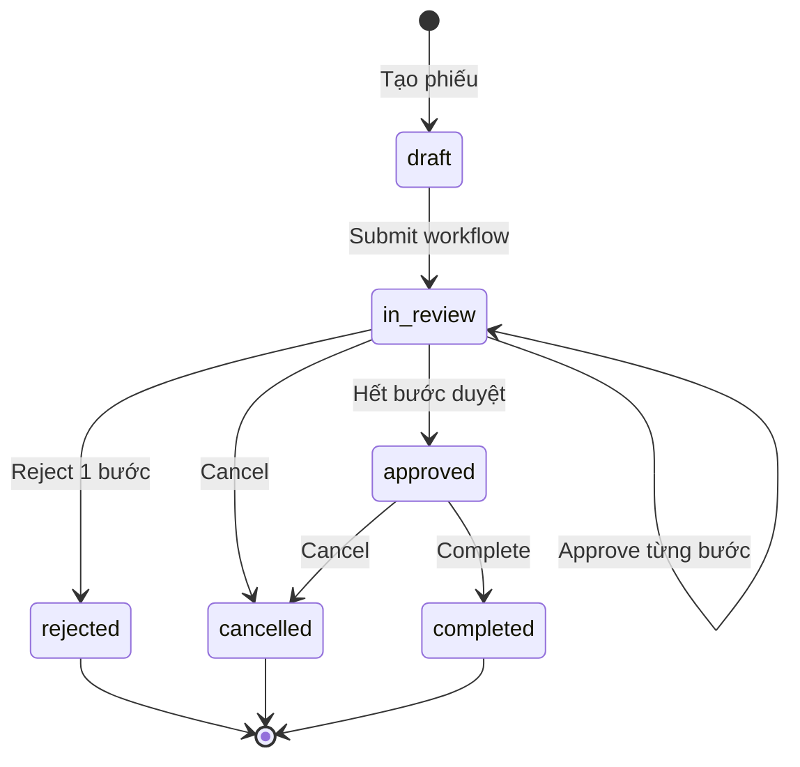
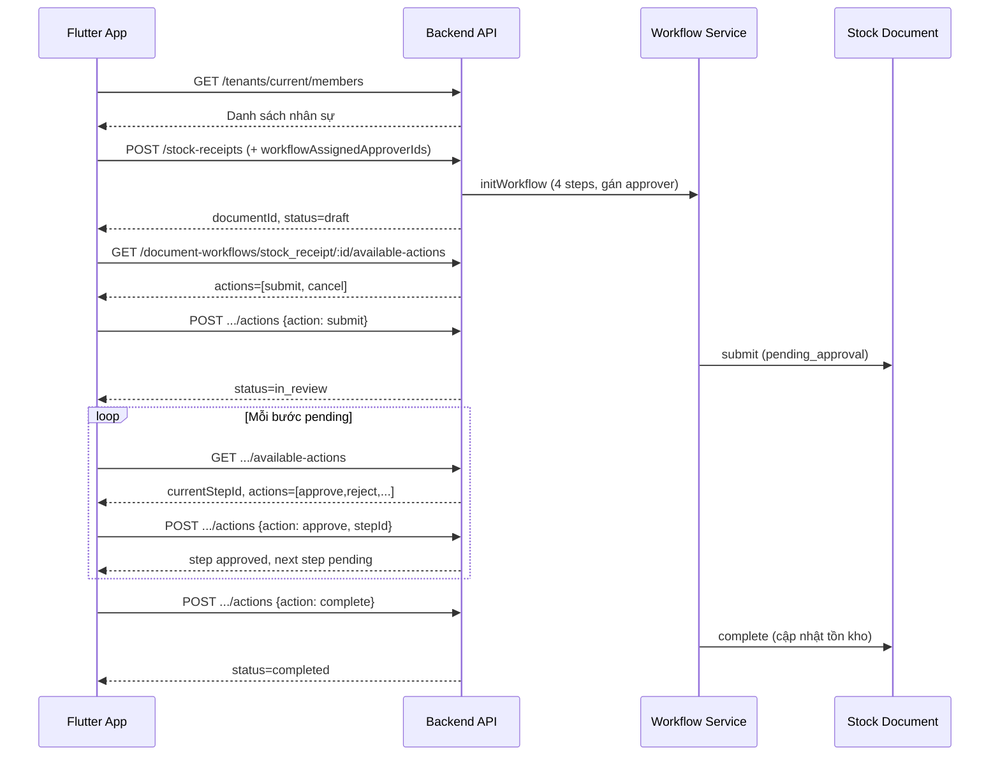

# Hướng dẫn API duyệt từng bước — Tích hợp Flutter

Tài liệu này mô tả **end-to-end** luồng duyệt phiếu **nhiều bước** (multi-step workflow) theo đúng thứ tự nghiệp vụ, dùng để tích hợp Flutter.

> **Quan trọng:** Nếu app dùng duyệt từng bước, **chỉ gọi API workflow** (`/document-workflows/...`). **Không** gọi `POST /stock-receipts/:id/approve` hoặc `POST /stock-issues/:id/approve` — các API đó là duyệt **1 cấp**, bỏ qua workflow.

---

## Mục lục

1. [Tổng quan](#1-tổng-quan)
2. [Quy ước kỹ thuật](#2-quy-ước-kỹ-thuật)
3. [Template bước duyệt](#3-template-bước-duyệt)
4. [Luồng nghiệp vụ theo thứ tự (Step-by-step)](#4-luồng-nghiệp-vụ-theo-thứ-tự-step-by-step)
5. [Chi tiết từng API](#5-chi-tiết-từng-api)
6. [Ma trận trạng thái](#6-ma-trận-trạng-thái)
7. [Phần CHECK — Validate trước khi gọi API](#7-phần-check--validate-trước-khi-gọi-api)
8. [Phần CHECK — Validate sau khi nhận response](#8-phần-check--validate-sau-khi-nhận-response)
9. [Phần CHECK — Hiển thị nút action trên UI](#9-phần-check--hiển-thị-nút-action-trên-ui)
10. [Xử lý lỗi backend](#10-xử-lý-lỗi-backend)
11. [Model & Service Flutter gợi ý](#11-model--service-flutter-gợi-ý)
12. [Checklist triển khai Flutter](#12-checklist-triển-khai-flutter)

---

## 1. Tổng quan

### 1.1 Hai lớp dữ liệu

Mỗi phiếu có **2 nguồn dữ liệu** cần đọc:

| Lớp | Mục đích | API |
|-----|----------|-----|
| **Nghiệp vụ phiếu** | Kho, dòng hàng, đối tác, số lượng… | `GET /stock-receipts/:id`, `GET /stock-issues/:id`, `GET /stock-opening-balances` |
| **Workflow duyệt** | Bước duyệt, người được gán, trạng thái từng bước | `GET /document-workflows/:documentType/:documentId` |

`documentId` trong workflow **= `id` của phiếu** (cùng một giá trị).

### 1.2 Luồng tóm tắt

```text
[B1] Lấy danh sách nhân sự (chọn người duyệt)
  ↓
[B2] Tạo phiếu + gán người duyệt từng bước
  ↓
[B3] (Tuỳ chọn) Sửa phiếu khi còn draft
  ↓
[B4] Submit workflow → phiếu chuyển chờ duyệt
  ↓
[B5] Lặp: từng bước pending → người được gán approve/reject/skip/proxy_sign
  ↓
[B6] Khi hết bước → workflow approved → phiếu approved
  ↓
[B7] Complete → cập nhật tồn kho
```

### 1.3 Sơ đồ trạng thái



---

## 2. Quy ước kỹ thuật

### 2.1 Base URL

```text
/api/v1
```

### 2.2 Header bắt buộc (mọi request)

```http
Authorization: Bearer <access_token>
X-Tenant-Id: <tenant_id>
Content-Type: application/json
```

### 2.3 Header cho mutation (POST/PATCH/PUT)

```http
Idempotency-Key: <uuid-v4>
```

> Sinh UUID **một lần** khi user bấm nút. Giữ nguyên key nếu retry cùng action.

### 2.4 Response envelope

**Thành công:**

```json
{ "success": true, "data": { ... } }
```

**Lỗi:**

```json
{
  "success": false,
  "error": {
    "code": "STEP_NOT_ASSIGNED",
    "message": "You are not assigned to approve this step"
  }
}
```

### 2.5 `documentType` enum

| Giá trị | Loại phiếu | API tạo phiếu |
|---------|------------|---------------|
| `stock_issue` | Phiếu xuất kho | `POST /stock-issues` |
| `stock_receipt` | Phiếu nhập kho | `POST /stock-receipts` |
| `stock_opening` | Phiếu đầu kỳ | `POST /stock-opening-balances` |

---

## 3. Template bước duyệt

Khi tạo phiếu, backend **tự khởi tạo workflow** với template cố định.

### 3.1 Phiếu xuất / phiếu nhập (3 bước số)

| sequence | stepCode | stepName | Gán người duyệt |
|----------|----------|----------|-----------------|
| 1 | `creator` | Người lập phiếu | Tự động = người tạo phiếu |
| 2 | `warehouse` | Thủ kho | `workflowAssignedApproverIds[0]` |
| 3 | `chief_accountant` | Kế toán trưởng | `workflowAssignedApproverIds[1]` |

- Cần **đúng 2** user ID trong `workflowAssignedApproverIds`.
- **Người giao hàng không còn trong workflow số.** Lưu tên/contact trên phiếu (`deliveredBy` / `deliveredByName`) để **ký tay sau khi in**.

### 3.2 Phiếu đầu kỳ (4 bước)

| sequence | stepCode | stepName | Gán người duyệt |
|----------|----------|----------|-----------------|
| 1 | `creator` | Người lập phiếu | Tự động |
| 2 | `warehouse` | Thủ kho | `workflowAssignedApproverIds[0]` |
| 3 | `chief_accountant` | Kế toán trưởng | `workflowAssignedApproverIds[1]` |
| 4 | `admin` | Admin doanh nghiệp | `workflowAssignedApproverIds[2]` |

- Cần **đúng 3** user ID trong `workflowAssignedApproverIds`.

### 3.3 Mapping mảng người duyệt

```text
workflowAssignedApproverIds[i]  →  bước có sequence = i + 2
```

Ví dụ phiếu nhập / xuất:

```json
"workflowAssignedApproverIds": ["user_warehouse", "user_accountant"]
```

| Index | User | Bước |
|-------|------|------|
| 0 | user_warehouse | warehouse |
| 1 | user_accountant | chief_accountant |

---

## 4. Luồng nghiệp vụ theo thứ tự (Step-by-step)

### Bước 1 — Lấy danh sách nhân sự để chọn người duyệt

**Khi nào gọi:** Màn tạo phiếu, trước khi submit form.

```http
GET /api/v1/tenants/current/members
```

**Mục đích:** Hiển thị dropdown/picker chọn người duyệt theo thứ tự bước (xuất/nhập: **2** người; đầu kỳ: **3** người).

**CHECK trước khi gọi:**
- [ ] Đã có `access_token`
- [ ] Đã chọn `tenant_id`

---

### Bước 2 — Tạo phiếu kèm gán người duyệt

**Khi nào gọi:** User bấm "Lưu phiếu" / "Tạo phiếu".

Backend tạo phiếu **và** khởi tạo workflow trong cùng một request.

#### Phiếu nhập kho

```http
POST /api/v1/stock-receipts
Idempotency-Key: <uuid>
```

```json
{
  "warehouseId": "wh_001",
  "supplierId": "sup_001",
  "receiptType": "purchase",
  "receiptDate": "2026-08-18T08:00:00.000Z",
  "deliveredByName": "Nguyễn Văn B",
  "note": "Nhập hàng từ NCC",
  "workflowAssignedApproverIds": [
    "user_010",
    "user_011"
  ],
  "lines": [
    {
      "productId": "prd_001",
      "unitName": "thùng",
      "expectedQty": 100,
      "actualQty": 98,
      "unitPrice": 120000,
      "batchNo": "L001",
      "expiryDate": "2027-08-18T00:00:00.000Z"
    }
  ]
}
```

> `deliveredByName` / contact người giao hàng chỉ để in phiếu (ký tay sau). Không gán vào `workflowAssignedApproverIds`.

#### Phiếu xuất kho

```http
POST /api/v1/stock-issues
Idempotency-Key: <uuid>
```

```json
{
  "warehouseId": "wh_001",
  "issueType": "sale",
  "customerId": "cus_001",
  "issueDate": "2026-08-18T08:00:00.000Z",
  "note": "Xuất bán",
  "workflowAssignedApproverIds": [
    "user_010",
    "user_011"
  ],
  "lines": [
    {
      "productId": "prd_001",
      "unitName": "thùng",
      "requestedQty": 10,
      "actualQty": 10,
      "unitPrice": 150000
    }
  ]
}
```

#### Phiếu đầu kỳ

```http
POST /api/v1/stock-opening-balances
Idempotency-Key: <uuid>
```

```json
{
  "warehouseId": "wh_001",
  "effectiveDate": "2026-08-18T08:00:00.000Z",
  "note": "Tồn đầu kỳ tháng 8",
  "workflowAssignedApproverIds": [
    "user_010",
    "user_011",
    "user_012"
  ],
  "lines": [
    {
      "productId": "prd_001",
      "qty": 500,
      "unitCost": 100000,
      "batchNo": "L001"
    }
  ]
}
```

**Response mẫu (phiếu nhập):**

```json
{
  "success": true,
  "data": {
    "id": "rcpt_abc123",
    "code": "PNK-0042",
    "status": "draft",
    "warehouseId": "wh_001",
    "details": [ ... ]
  }
}
```

**Lưu `documentId`:** `data.id` — dùng cho mọi API workflow sau này.

**CHECK sau khi tạo:**
- [ ] `data.status === "draft"`
- [ ] Gọi `GET /document-workflows/stock_receipt/{data.id}` để xác nhận workflow đã init
- [ ] Workflow `status === "draft"`
- [ ] `steps.length === 4`
- [ ] `steps[0].stepCode === "creator"` và `assignedApproverId === currentUserId`

---

### Bước 3 — (Tuỳ chọn) Sửa phiếu draft

**Khi nào gọi:** Phiếu còn `draft`, user sửa thông tin.

```http
PUT /api/v1/stock-receipts/:id
PUT /api/v1/stock-issues/:id
```

> **Lưu ý:** API update **không** đổi người duyệt workflow. Muốn đổi người duyệt → dùng Bước 10 (assign step).

**CHECK trước khi gọi:**
- [ ] Phiếu `status === "draft"`
- [ ] Workflow `status === "draft"`

---

### Bước 4 — Kiểm tra action được phép (trước khi hiện nút)

**Khi nào gọi:** Mỗi lần mở màn chi tiết phiếu, hoặc sau mỗi action thành công.

```http
GET /api/v1/document-workflows/:documentType/:documentId/available-actions
```

**Ví dụ:**

```http
GET /api/v1/document-workflows/stock_receipt/rcpt_abc123/available-actions
```

**Response mẫu:**

```json
{
  "success": true,
  "data": {
    "documentId": "rcpt_abc123",
    "documentType": "stock_receipt",
    "status": "in_review",
    "currentStepId": "step_warehouse_001",
    "currentStepCode": "warehouse",
    "currentStepName": "Thủ kho",
    "currentStepAssignedApproverId": "user_011",
    "actions": ["approve", "reject", "proxy_sign", "skip", "cancel"]
  }
}
```

**Cách dùng trên Flutter:**

```dart
// Chỉ hiện nút nếu backend trả action trong list
final canApprove = availableActions.actions.contains('approve');
final canReject  = availableActions.actions.contains('reject');
final canSubmit  = availableActions.actions.contains('submit');
final canComplete = availableActions.actions.contains('complete');
```

**CHECK:**
- [ ] Nếu `actions` rỗng → ẩn toàn bộ nút action
- [ ] Luôn ưu tiên `available-actions` hơn tự suy diễn từ role

---

### Bước 5 — Submit phiếu (gửi duyệt)

**Khi nào gọi:** User bấm "Gửi duyệt", phiếu đang `draft`.

```http
POST /api/v1/document-workflows/:documentType/:documentId/actions
Idempotency-Key: <uuid>
```

```json
{
  "action": "submit",
  "note": "Gửi duyệt phiếu nhập kho"
}
```

**Không cần `stepId`** cho action `submit`.

**Sau submit:**
- Workflow: `draft` → `in_review`
- Phiếu nghiệp vụ: `draft` → `pending_approval` (backend tự đồng bộ qua adapter)

**CHECK trước khi gọi:**
- [ ] Workflow `status === "draft"`
- [ ] Phiếu `status === "draft"`
- [ ] Form nghiệp vụ hợp lệ (xem mục 7)
- [ ] `available-actions` có chứa `"submit"`

**CHECK sau khi thành công:**
- [ ] Workflow `status === "in_review"`
- [ ] Phiếu `status === "pending_approval"`
- [ ] Có ít nhất 1 step `status === "pending"`

---

### Bước 6 — Duyệt từng bước (Approve)

**Khi nào gọi:** Workflow `in_review`, user là người được gán ở bước đang `pending`.

```http
POST /api/v1/document-workflows/:documentType/:documentId/actions
Idempotency-Key: <uuid>
```

```json
{
  "action": "approve",
  "stepId": "step_warehouse_001",
  "note": "Đã kiểm tra đủ hàng, lô đúng hạn"
}
```

**Quy tắc:**
- `stepId` **bắt buộc** — lấy từ `available-actions.currentStepId` hoặc step đầu tiên có `status === "pending"` trong workflow detail
- Chỉ **người được gán** (`assignedApproverId`) mới approve được bước đó
- Mỗi lần approve chỉ xử lý **1 bước**
- Sau approve, bước tiếp theo chuyển sang `pending`

**CHECK trước khi gọi:**
- [ ] Workflow `status === "in_review"`
- [ ] `stepId` không rỗng
- [ ] Step tương ứng `status === "pending"`
- [ ] `currentUserId === step.assignedApproverId` (hoặc `assignedApproverId == null`)
- [ ] `available-actions.actions` chứa `"approve"`

**CHECK sau khi thành công:**
- [ ] Step vừa approve có `status === "approved"`, `actualSignerId === currentUserId`
- [ ] Nếu còn bước pending → workflow vẫn `in_review`, `currentStepCode` đổi sang bước tiếp
- [ ] Nếu hết bước → workflow `approved`, phiếu `approved`

**Response workflow khi còn bước tiếp:**

```json
{
  "success": true,
  "data": {
    "id": "wf_001",
    "documentType": "stock_receipt",
    "documentId": "rcpt_abc123",
    "status": "in_review",
    "currentStepCode": "chief_accountant",
    "currentStepStatus": "pending",
    "steps": [
      { "stepCode": "creator", "status": "approved", "..." : "..." },
      { "stepCode": "warehouse", "status": "approved", "actualSignerId": "user_010", "..." : "..." },
      { "stepCode": "chief_accountant", "status": "pending", "assignedApproverId": "user_011", "..." : "..." }
    ]
  }
}
```

---

### Bước 7 — Từ chối duyệt (Reject)

**Khi nào gọi:** Người được gán từ chối ở bước đang `pending`.

```http
POST /api/v1/document-workflows/:documentType/:documentId/actions
Idempotency-Key: <uuid>
```

```json
{
  "action": "reject",
  "stepId": "step_warehouse_001",
  "note": "Thiếu thông tin lô hàng, cần bổ sung CO/CQ"
}
```

**Hậu quả:**
- Bước hiện tại → `rejected`
- Các bước pending còn lại → `cancelled`
- Workflow → `rejected`
- Phiếu nghiệp vụ → `rejected`

**CHECK trước khi gọi:**
- [ ] Workflow `status === "in_review"`
- [ ] `stepId` không rỗng
- [ ] `note` không rỗng (UI bắt buộc nhập lý do, dù backend chỉ khuyến nghị)
- [ ] User có quyền (assignedApproverId)
- [ ] Hiện confirm dialog

**CHECK sau khi thành công:**
- [ ] Workflow `status === "rejected"`
- [ ] Phiếu `status === "rejected"`
- [ ] Ẩn mọi nút action trừ "Tạo lại" (phiếu nhập có clone API)

**Tạo lại phiếu nhập bị reject:**

```http
POST /api/v1/stock-receipts/:id/clone-from-rejected
Idempotency-Key: <uuid>
```

> Clone tạo phiếu mới ở `draft`. Cần gán lại `workflowAssignedApproverIds` nếu muốn đổi người duyệt (clone hiện tại copy nội dung phiếu, workflow mới được init lại).

---

### Bước 8 — (Tuỳ chọn) Skip bước optional

**Khi nào gọi:** Bước hiện tại có `optional: true` và không cần ký trên hệ thống.

> Phiếu xuất/nhập **mới** không còn bước `delivery` trong workflow. `skip` chủ yếu còn hữu ích với phiếu cũ còn bước optional.

```json
{
  "action": "skip",
  "stepId": "step_optional_001",
  "note": "Bỏ qua bước không bắt buộc"
}
```

**CHECK:**
- [ ] Chỉ skip bước `optional`
- [ ] Step `status === "pending"`

---

### Bước 9 — (Tuỳ chọn) Ký thay (Proxy Sign)

**Luồng 2 bước:**

#### 9a. Upload giấy ủy quyền

```http
POST /api/v1/document-workflows/:documentType/:documentId/steps/:stepId/authorizations
Idempotency-Key: <uuid>
```

```json
{
  "fileUrl": "https://cdn.example.com/auth/doc.pdf",
  "fileName": "uy-quyen.pdf",
  "authorizationNo": "UQ-2026-001",
  "issuedBy": "Giám đốc Công ty ABC",
  "issuedAt": "2026-08-01T00:00:00.000Z",
  "validFrom": "2026-08-01T00:00:00.000Z",
  "validTo": "2027-08-01T00:00:00.000Z",
  "note": "Ủy quyền ký thay thủ kho"
}
```

**Response:**

```json
{ "success": true, "data": { "id": "auth_001" } }
```

#### 9b. Thực hiện proxy sign

```json
{
  "action": "proxy_sign",
  "stepId": "step_warehouse_001",
  "proxySignerId": "user_original_approver",
  "authorizationIds": ["auth_001"],
  "note": "Ký thay theo giấy ủy quyền số UQ-2026-001"
}
```

**CHECK trước proxy_sign:**
- [ ] `proxySignerId` không rỗng
- [ ] `authorizationIds.length >= 1`
- [ ] Giấy ủy quyền còn hiệu lực (`validFrom <= now <= validTo`)
- [ ] Giấy ủy quyền có `fileUrl`

---

### Bước 10 — (Tuỳ chọn) Đổi người duyệt bước pending

**Khi nào gọi:** Cần chuyển quyền duyệt sang người khác trước khi họ approve.

```http
PATCH /api/v1/document-workflows/:documentType/:documentId/steps/:stepId/assignee
Idempotency-Key: <uuid>
```

```json
{
  "assignedApproverId": "user_new_approver"
}
```

**CHECK:**
- [ ] Step `status === "pending"` (không đổi được step đã xử lý)
- [ ] `assignedApproverId` là member hợp lệ trong tenant

---

### Bước 11 — Hoàn tất phiếu (Complete)

**Khi nào gọi:** Workflow `approved`, tất cả bước đã xong.

```http
POST /api/v1/document-workflows/:documentType/:documentId/actions
Idempotency-Key: <uuid>
```

```json
{
  "action": "complete",
  "note": "Hoàn tất nhập kho"
}
```

**Không cần `stepId`.**

**Sau complete:**
- Workflow → `completed`
- Phiếu → `completed`
- Tồn kho được cập nhật (async job)

**Response phiếu complete (nghiệp vụ) có thể trả:**

```json
{
  "queued": true,
  "jobId": "job_xyz",
  "status": "processing"
}
```

**CHECK trước khi gọi:**
- [ ] Workflow `status === "approved"`
- [ ] Phiếu `status === "approved"`
- [ ] `available-actions.actions` chứa `"complete"`

---

### Bước 12 — Hủy phiếu (Cancel)

**Khi nào gọi:** User muốn hủy phiếu (draft / in_review / approved).

```json
{
  "action": "cancel",
  "note": "Hủy do nhập sai kho"
}
```

**CHECK:**
- [ ] Workflow không ở `completed` hoặc `rejected`
- [ ] Hiện confirm dialog

---

## 5. Chi tiết từng API

### 5.1 Danh sách workflow — "Chờ tôi duyệt"

```http
GET /api/v1/document-workflows?assignedApproverId=<current_user_id>&status=in_review&page=1&limit=20
```

**Query params:**

| Param | Type | Mô tả |
|-------|------|-------|
| `documentType` | enum? | `stock_issue` / `stock_receipt` / `stock_opening` |
| `status` | enum? | `draft`, `in_review`, `approved`, `rejected`, `cancelled`, `completed` |
| `assignedApproverId` | string? | Lọc phiếu có bước pending gán cho user này |
| `page` | int | Mặc định 1 |
| `limit` | int | Mặc định 20, max 200 |

**Response structure (chú ý nested `data`):**

```json
{
  "success": true,
  "data": {
    "data": [
      {
        "id": "wf_001",
        "documentType": "stock_receipt",
        "documentId": "rcpt_abc123",
        "status": "in_review",
        "currentStepCode": "warehouse",
        "currentStepStatus": "pending",
        "currentStepUpdatedAt": "2026-08-18T10:00:00.000Z",
        "lastActionById": "user_010",
        "lastActionAt": "2026-08-18T09:30:00.000Z",
        "steps": [ ... ]
      }
    ],
    "pagination": {
      "page": 1,
      "limit": 20,
      "total": 5,
      "totalPages": 1
    }
  }
}
```

**Flutter parse:**

```dart
final outer = response.data;           // Map
final items = outer['data'] as List; // workflows
final pagination = outer['pagination'];
```

---

### 5.2 Chi tiết workflow

```http
GET /api/v1/document-workflows/:documentType/:documentId
```

**Response:**

```json
{
  "success": true,
  "data": {
    "id": "wf_001",
    "documentType": "stock_receipt",
    "documentId": "rcpt_abc123",
    "status": "in_review",
    "currentStepCode": "warehouse",
    "currentStepStatus": "pending",
    "currentStepUpdatedAt": "2026-08-18T10:00:00.000Z",
    "lastActionById": "user_010",
    "lastActionAt": "2026-08-18T09:30:00.000Z",
    "steps": [
      {
        "id": "step_001",
        "stepCode": "creator",
        "stepName": "Người lập phiếu",
        "sequence": 1,
        "status": "approved",
        "requiredSignerId": "user_001",
        "assignedApproverId": "user_001",
        "actualSignerId": "user_001",
        "authorizedSignerId": null,
        "note": null,
        "actionAt": "2026-08-18T09:00:00.000Z"
      },
      {
        "id": "step_003",
        "stepCode": "warehouse",
        "stepName": "Thủ kho",
        "sequence": 3,
        "status": "pending",
        "requiredSignerId": "user_011",
        "assignedApproverId": "user_011",
        "actualSignerId": null,
        "authorizedSignerId": null,
        "note": null,
        "actionAt": null
      }
    ]
  }
}
```

**Kết hợp với chi tiết phiếu:**

```http
GET /api/v1/stock-receipts/rcpt_abc123
```

---

### 5.3 Timeline lịch sử duyệt

```http
GET /api/v1/document-workflows/:documentType/:documentId/timeline
```

**Response:**

```json
{
  "success": true,
  "data": [
    {
      "id": "hist_001",
      "fromStatus": "draft",
      "toStatus": "in_review",
      "changedById": "user_001",
      "changedByRole": "warehouse_keeper",
      "note": "Submitted",
      "changedAt": "2026-08-18T09:30:00.000Z",
      "metadata": null
    },
    {
      "id": "hist_002",
      "fromStatus": "pending",
      "toStatus": "approved",
      "changedById": "user_011",
      "changedByRole": "warehouse_keeper",
      "note": "Đã kiểm tra đủ hàng",
      "changedAt": "2026-08-18T10:00:00.000Z",
      "metadata": null
    }
  ]
}
```

---

### 5.4 Action enum đầy đủ

| action | Cần stepId? | Workflow status cho phép | Mô tả |
|--------|-------------|--------------------------|-------|
| `submit` | ❌ | `draft` | Gửi duyệt |
| `approve` | ✅ | `in_review` | Duyệt 1 bước |
| `reject` | ✅ | `in_review` | Từ chối 1 bước |
| `proxy_sign` | ✅ | `in_review` | Ký thay |
| `skip` | ✅ | `in_review` | Bỏ qua bước optional |
| `cancel` | ❌ | `draft`, `in_review`, `approved` | Hủy phiếu |
| `complete` | ❌ | `approved` | Hoàn tất, cập nhật tồn |
| `return` | — | *(chưa implement)* | — |

---

## 6. Ma trận trạng thái

### 6.1 Workflow status ↔ Phiếu nghiệp vụ status

| Workflow status | Phiếu status (stock) | Ý nghĩa UI |
|-----------------|----------------------|------------|
| `draft` | `draft` | Nháp, có thể sửa |
| `in_review` | `pending_approval` | Đang duyệt từng bước |
| `approved` | `approved` | Duyệt xong, chờ hoàn tất |
| `rejected` | `rejected` | Bị từ chối |
| `cancelled` | `cancelled` | Đã hủy |
| `completed` | `completed` | Hoàn tất |

### 6.2 Step status

| Step status | Màu UI gợi ý | Ý nghĩa |
|-------------|--------------|---------|
| `pending` | Xám / highlight | Đang chờ xử lý |
| `approved` | Xanh | Đã duyệt |
| `rejected` | Đỏ | Bị từ chối |
| `signed_by_proxy` | Xanh lam | Ký thay |
| `skipped` | Cam | Bỏ qua |
| `cancelled` | Xám đậm | Bị hủy do reject/cancel |

---

## 7. Phần CHECK — Validate trước khi gọi API

### 7.1 CHECK khi tạo phiếu

#### Phiếu nhập (`stock_receipt`)

| # | Rule | Client check | Backend error nếu fail |
|---|------|--------------|------------------------|
| 1 | `warehouseId` bắt buộc | ✅ | `VALIDATION_ERROR` |
| 2 | `receiptType` bắt buộc | ✅ | `VALIDATION_ERROR` |
| 3 | `lines.length >= 1` | ✅ | `VALIDATION_ERROR` |
| 4 | `actualQty > 0` mỗi dòng | ✅ | `VALIDATION_ERROR` |
| 5 | `expectedQty >= 0` | ✅ | `VALIDATION_ERROR` |
| 6 | `unitPrice >= 0` | ✅ | `VALIDATION_ERROR` |
| 7 | `workflowAssignedApproverIds.length === 2` | ✅ | `VALIDATION_ERROR`: *assignedApproverIds must include an approver for each workflow step after creator* |
| 8 | 2 user ID phải khác nhau (khuyến nghị) | ✅ UI | — |
| 9 | User ID phải tồn tại trong tenant | ✅ | — |

#### Phiếu xuất (`stock_issue`)

| # | Rule | Client check |
|---|------|--------------|
| 1 | `issueType` bắt buộc | ✅ |
| 2 | `issueType === "sale"` → `customerId` bắt buộc | ✅ |
| 3 | `lines.length >= 1` | ✅ |
| 4 | `requestedQty > 0`, `actualQty > 0` | ✅ |
| 5 | `workflowAssignedApproverIds.length === 2` | ✅ |

#### Phiếu đầu kỳ (`stock_opening`)

| # | Rule | Client check |
|---|------|--------------|
| 1 | `warehouseId`, `effectiveDate` bắt buộc | ✅ |
| 2 | `lines.length >= 1`, `qty > 0`, `unitCost >= 0` | ✅ |
| 3 | `workflowAssignedApproverIds.length === 3` | ✅ |

---

### 7.2 CHECK trước Submit

```dart
bool canSubmit({
  required WorkflowDocument workflow,
  required StockDocument document,
  required List<String> availableActions,
}) {
  if (!availableActions.contains('submit')) return false;
  if (workflow.status != 'draft') return false;
  if (document.status != 'draft') return false;
  if (document.lines.isEmpty) return false;
  // thêm validate nghiệp vụ...
  return true;
}
```

---

### 7.3 CHECK trước Approve / Reject

```dart
bool canApproveStep({
  required WorkflowStep step,
  required String currentUserId,
  required List<String> availableActions,
  required String workflowStatus,
}) {
  if (workflowStatus != 'in_review') return false;
  if (!availableActions.contains('approve')) return false;
  if (step.status != 'pending') return false;
  if (step.assignedApproverId != null &&
      step.assignedApproverId != currentUserId) return false;
  return true;
}

bool canRejectStep({ ... }) {
  // tương tự canApproveStep nhưng check 'reject'
  // thêm: rejectReason.trim().isNotEmpty
}
```

---

### 7.4 CHECK trước Complete

```dart
bool canComplete({
  required String workflowStatus,
  required String documentStatus,
  required List<String> availableActions,
}) {
  return workflowStatus == 'approved'
      && documentStatus == 'approved'
      && availableActions.contains('complete');
}
```

---

### 7.5 CHECK chọn người duyệt trên form tạo phiếu

```dart
String? validateApproverIds(List<String> ids) {
  if (ids.length != 3) {
    return 'Phải chọn đủ 3 người duyệt (Giao hàng, Thủ kho, Kế toán trưởng)';
  }
  if (ids.toSet().length != 3) {
    return 'Mỗi bước phải có người duyệt khác nhau';
  }
  return null;
}
```

---

## 8. Phần CHECK — Validate sau khi nhận response

Sau **mỗi mutation thành công**, Flutter nên refresh và verify:

### 8.1 Sau Submit

```dart
void verifyAfterSubmit(WorkflowDocument wf, StockDocument doc) {
  assert(wf.status == 'in_review');
  assert(doc.status == 'pending_approval');
  assert(wf.steps.any((s) => s.status == 'pending'));
}
```

### 8.2 Sau Approve 1 bước

```dart
void verifyAfterStepApprove({
  required WorkflowDocument wf,
  required String approvedStepId,
  required bool wasLastStep,
}) {
  final step = wf.steps.firstWhere((s) => s.id == approvedStepId);
  assert(step.status == 'approved');
  assert(step.actualSignerId != null);

  if (wasLastStep) {
    assert(wf.status == 'approved');
  } else {
    assert(wf.status == 'in_review');
    assert(wf.currentStepStatus == 'pending');
  }
}
```

### 8.3 Sau Reject

```dart
void verifyAfterReject(WorkflowDocument wf, StockDocument doc) {
  assert(wf.status == 'rejected');
  assert(doc.status == 'rejected');
  assert(wf.currentStepCode == null);
}
```

### 8.4 Sau Complete

```dart
void verifyAfterComplete(WorkflowDocument wf) {
  assert(wf.status == 'completed');
}
```

### 8.5 Refresh strategy

Sau mỗi action thành công, gọi **song song**:

1. `GET /document-workflows/:documentType/:documentId`
2. `GET /stock-receipts/:id` (hoặc issues/opening)
3. `GET .../available-actions`
4. (Nếu đang mở tab timeline) `GET .../timeline`

---

## 9. Phần CHECK — Hiển thị nút action trên UI

### 9.1 Quy tắc vàng

> **Không tự suy diễn quyền từ role.** Luôn dùng `available-actions` làm nguồn chính.

### 9.2 Bảng nút theo workflow status

| Workflow status | Nút có thể hiện (nếu có trong `actions`) |
|-----------------|------------------------------------------|
| `draft` | Submit, Cancel, Edit |
| `in_review` | Approve, Reject, Proxy Sign, Skip, Cancel |
| `approved` | Complete, Cancel |
| `rejected` | Clone (phiếu nhập), Tạo mới |
| `cancelled` | — |
| `completed` | — |

### 9.3 Widget stepper — logic highlight

```dart
WorkflowStep? currentPendingStep(WorkflowDocument wf) {
  return wf.steps.cast<WorkflowStep?>().firstWhere(
    (s) => s!.status == 'pending',
    orElse: () => null,
  );
}

bool isMyTurn({
  required WorkflowStep step,
  required String currentUserId,
}) {
  return step.status == 'pending' &&
      (step.assignedApproverId == null ||
       step.assignedApproverId == currentUserId);
}
```

### 9.4 Badge trên list "Chờ tôi duyệt"

Hiển thị tab/filter:

```dart
// Tab "Chờ tôi duyệt"
GET /document-workflows?assignedApproverId=$currentUserId&status=in_review

// Tab "Tôi tạo"
GET /stock-receipts (filter client-side createdById == currentUserId)
// hoặc kết hợp workflow list
```

---

## 10. Xử lý lỗi backend

| Code | HTTP | Khi nào xảy ra | Xử lý Flutter |
|------|------|----------------|---------------|
| `VALIDATION_ERROR` | 400 | Form sai, thiếu approver IDs | Hiện lỗi field |
| `WORKFLOW_NOT_FOUND` | 404 | Phiếu chưa có workflow | Refresh / báo lỗi |
| `WORKFLOW_EXISTS` | 409 | Init workflow trùng | Không nên xảy ra khi create |
| `STEP_NOT_FOUND` | 404 | stepId sai / không còn pending | Refresh detail |
| `STEP_NOT_PENDING` | 409 | Bước đã xử lý (double tap) | Refresh, coi như stale |
| `STEP_NOT_ASSIGNED` | 403 | User không phải người được gán | Ẩn nút, báo không có quyền |
| `INVALID_ACTION` | 409 | Action không hợp lệ với status hiện tại | Refresh available-actions |
| `INVALID_STATUS_TRANSITION` | 409 | Phiếu sai trạng thái | Refresh |
| `AUTHORIZATION_INVALID` | 400 | Giấy ủy quyền thiếu/hết hạn | Hiện lỗi form ủy quyền |
| `FORBIDDEN` | 403 | Thiếu role | Báo không đủ quyền |
| `IDEMPOTENCY_IN_PROGRESS` | 409 | Request trùng đang xử lý | Chờ / retry |
| `IDEMPOTENT_SKIP` | 200 | Request trùng đã xử lý xong | Refresh, coi thành công |

---

## 11. Model & Service Flutter gợi ý

### 11.1 Repository interface

```dart
abstract class WorkflowRepository {
  Future<MemberList> listMembers();
  Future<StockReceipt> createReceipt(CreateReceiptRequest req);
  Future<WorkflowDocument> getWorkflow(String documentType, String documentId);
  Future<AvailableActions> getAvailableActions(String documentType, String documentId);
  Future<WorkflowDocument> performAction(String documentType, String documentId, WorkflowActionRequest req);
  Future<WorkflowDocument> assignStep(String documentType, String documentId, String stepId, String approverId);
  Future<List<TimelineEvent>> getTimeline(String documentType, String documentId);
  Future<WorkflowListPage> listWorkflows({String? assignedApproverId, String? status, int page = 1});
}
```

### 11.2 Action request model

```dart
class WorkflowActionRequest {
  final String action;       // submit | approve | reject | ...
  final String? stepId;
  final String? note;
  final String? proxySignerId;
  final List<String>? authorizationIds;

  Map<String, dynamic> toJson() => {
    'action': action,
    if (stepId != null) 'stepId': stepId,
    if (note != null && note!.isNotEmpty) 'note': note,
    if (proxySignerId != null) 'proxySignerId': proxySignerId,
    if (authorizationIds != null) 'authorizationIds': authorizationIds,
  };
}
```

### 11.3 Ví dụ gọi approve

```dart
Future<void> approveCurrentStep({
  required String documentType,
  required String documentId,
  required AvailableActions available,
  required String note,
}) async {
  final stepId = available.currentStepId;
  if (stepId == null) throw StateError('No pending step');

  await workflowRepo.performAction(
    documentType,
    documentId,
    WorkflowActionRequest(
      action: 'approve',
      stepId: stepId,
      note: note,
    ),
  );
}
```

---

## 12. Checklist triển khai Flutter

### A. Setup API client

- [ ] Interceptor `Authorization: Bearer ...`
- [ ] Interceptor `X-Tenant-Id: ...`
- [ ] Interceptor `Idempotency-Key` cho POST/PATCH
- [ ] Parse `{ success, data }` và `{ success: false, error: { code, message } }`

### B. Màn tạo phiếu

- [ ] Load members (`GET /tenants/current/members`)
- [ ] Xuất/nhập: **2** picker (thủ kho, kế toán); đầu kỳ: **3** picker
- [ ] Validate `workflowAssignedApproverIds.length === 2` (xuất/nhập) hoặc `=== 3` (đầu kỳ)
- [ ] Contact / tên người giao hàng chỉ để in (ký tay), không đưa vào mảng duyệt
- [ ] Validate form nghiệp vụ trước submit
- [ ] Sau create: lưu `documentId`, navigate sang detail

### C. Màn chi tiết phiếu

- [ ] Parallel fetch: phiếu nghiệp vụ + workflow + available-actions
- [ ] Stepper theo số bước template (xuất/nhập: **3** bước số)
- [ ] Highlight bước `pending`
- [ ] Hiện tên người được gán (`assignedApproverId` → resolve tên từ members)
- [ ] Tab timeline (`GET .../timeline`)

### D. Action workflow

- [ ] Nút chỉ hiện khi có trong `available-actions.actions`
- [ ] Confirm dialog cho approve / reject / complete / cancel
- [ ] Reject bắt buộc nhập lý do (`note`)
- [ ] Approve/reject/skip/proxy_sign: luôn gửi `stepId` từ `currentStepId`
- [ ] Disable nút khi đang loading
- [ ] Sau success: refresh detail + list + available-actions

### E. Màn "Chờ tôi duyệt"

- [ ] `GET /document-workflows?assignedApproverId=me&status=in_review`
- [ ] Parse nested `data.data`
- [ ] Tap → mở detail với nút approve/reject nếu đúng lượt

### F. Edge cases

- [ ] `IDEMPOTENT_SKIP` → refresh, không báo lỗi
- [ ] `STEP_NOT_PENDING` → refresh detail (stale UI)
- [ ] `STEP_NOT_ASSIGNED` → ẩn nút
- [ ] Phiếu rejected → hiện "Tạo lại" (receipt: clone-from-rejected)
- [ ] **Không gọi** `/stock-receipts/:id/approve` khi dùng workflow nhiều bước

### G. Test scenarios

- [ ] Tạo phiếu → submit → approve creator → warehouse → chief_accountant → complete
- [ ] Reject ở bước giữa → phiếu rejected, các bước sau cancelled
- [ ] User không được gán → không thấy nút approve
- [ ] Assign lại người duyệt → user mới thấy nút
- [ ] Double tap approve → idempotency / STEP_NOT_PENDING

---

## Phụ lục — Sequence diagram đầy đủ



---

## Tài liệu liên quan

- [STOCK_DOCUMENT_API.md](./STOCK_DOCUMENT_API.md) — API phiếu xuất/nhập/đầu kỳ
- [FLUTTER_WORKFLOW_GUIDE.md](./FLUTTER_WORKFLOW_GUIDE.md) — Kiến trúc màn hình Flutter
- [PHIEU_LUONG_THIET_KE_WORKFLOW_DUYET.md](./PHIEU_LUONG_THIET_KE_WORKFLOW_DUYET.md) — Thiết kế workflow chi tiết
